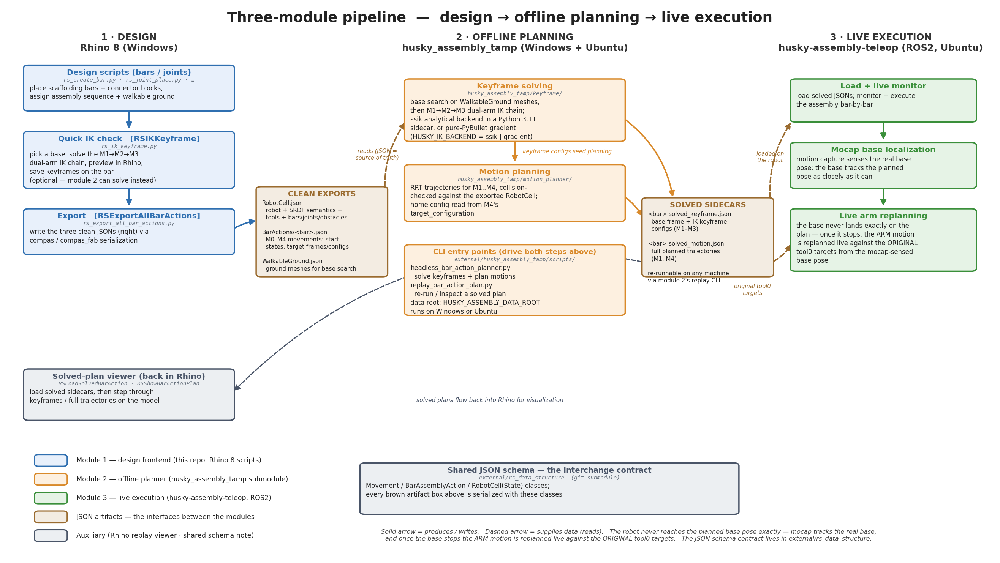

# Bar Joint Rhino Design Workflow

Interactive Rhino 8 scripts for placing scaffolding bars and pluggable
connector blocks ("joint pairs"). The Rhino-facing workflow uses only the
core math stack (`numpy` + `scipy`) and is split into two stages:

- **T1 – Bar axis**: snap a new bar onto an existing bar, or add a brace
  between two bars with interactive solution selection.
- **T2 – Joint placement**: place connector blocks on a bar pair using a
  4-DOF optimizer that aligns the female and male screw holes.

  Each connector family is described by a **joint pair**: a female + male
  block definition with the geometry needed to drive the optimizer. Joint
  pairs are authored interactively in Rhino with `RSDefineJointHalf` /
  `RSDefineJointMate` and
  stored in `scripts/core/joint_pairs.json` along with their `.3dm` block
  assets in `asset/`.

## Three-module pipeline

This repo is the first of three modules that carry a scaffolding design from
Rhino all the way to a real robot:



1. **Design front-end (this repo, Rhino 8 / Windows).** Design the scaffolding
   (bars, joints, assembly sequence, walkable ground), run quick IK keyframe
   checks (`RSIKKeyframe`), then export everything as three JSON files via
   compas / compas_fab serialization. The JSONs carry the complete scene — the
   robot model with SRDF semantics, both arm tools, every bar / joint /
   obstacle body, per-movement start states with the allowed-contact policy,
   end-effector targets, and the home configuration — so the downstream
   modules never read anything from Rhino or from this repo's Python config.
2. **Offline planner (`external/husky_assembly_tamp` submodule, Windows +
   Ubuntu).** Consumes only the exported JSONs. It solves the robot base +
   M1→M2→M3 IK keyframes (base search on the walkable-ground meshes, dual-arm
   analytical IK via the ssik sidecar), then plans full RRT trajectories
   between the keyframes, and writes the results as sidecar files next to the
   clean exports. How to run it:
   [external/husky_assembly_tamp/scripts/README_headless_bar_action.md](external/husky_assembly_tamp/scripts/README_headless_bar_action.md).
3. **Live execution ([husky-assembly-teleop], ROS2 / Ubuntu).** Loads the
   solved JSONs on the robot. Motion capture localizes the mobile base; the
   base tracks its planned pose as closely as it can, and — since it never
   lands on it exactly — once the base stops, the **arm** motion is replanned
   live against the **original tool0 targets** using the mocap-sensed base
   pose. Solved plans also flow back into Rhino for visualization
   (`RSLoadSolvedBarAction` / `RSShowBarActionPlan`).

| Artifact | Produced by | Consumed by |
|---|---|---|
| `RobotCell.json` (robot + tools + all rigid bodies) | 1 · `RSExportRobotCell` / `RSExportAllBarActions` | 2 (scene rebuild), 3 |
| `BarActions/<bar>.json` (M0–M4 movements) | 1 · `RSExportBarAction` / `RSExportAllBarActions` | 2 (solve input) |
| `WalkableGround.json` (ground meshes) | 1 · `RSExportAllBarActions` | 2 (`--base sample` search) |
| `<bar>.solved_keyframe.json` (base + IK keyframes) | 2 · `--solve-keyframes` | 2 (motion planning), 1 (viewer) |
| `<bar>.solved_motion.json` (full trajectories) | 2 · `--movement all` | 3 (execution), 1 (viewer) |

The JSON schema shared by all three modules lives in the
[rs_data_structure](https://github.com/yijiangh/rs_data_structure) submodule
(`external/rs_data_structure`). After pulling a new version of any submodule,
reload Rhino's Python engine (**ScriptEditor → Tools → Reload Python 3
(CPython) Engine**) so no stale module copies linger — the same ritual already
documented for compas_fab below.

[husky-assembly-teleop]: https://github.com/yijiangh/husky-assembly-teleop

## Rhino 8 Workshop Install (Start Here)

### 1. Get the repository onto your machine

Use either option:

- **Clone with Git**

  ```bash
  git clone https://github.com/<org>/bar_joint_rhino_design_workflow.git
  ```

- **Download ZIP** from GitHub, then unzip it to a local folder (for example, inside Documents).

Example install location:

`C:\Users\<your-user>\Documents\bar_joint_rhino_design_workflow`

### 2. Configure Rhino 8

1. Open **Tools -> Options -> Files -> Search Paths**.
2. Add the repository's `scripts` folder.
   Example:
   `C:\Users\<your-user>\Documents\bar_joint_rhino_design_workflow\scripts`
3. Open **Tools -> Toolbars -> File -> Open Toolbar File...**.
4. Select `scaffolding_toolbar.rui` from the repository root.
5. Show and dock the **RSDesign** and **RSSetup** toolbars.

### 3. Run any toolbar command once

**No manual pip install is needed for Rhino usage.** Each Rhino entry-point
script declares its own virtual environment and requirements using Rhino 8
ScriptEditor directives:

```python
#! python 3
# venv: scaffolding_env
# r: numpy
# r: scipy
```

The first time you run any script, Rhino's ScriptEditor creates the
shared `scaffolding_env` venv and installs the required packages. If the
install ever fails, reset via **Tools → Advanced → Reset Python 3
(CPython) Runtime** in the ScriptEditor and re-run.

## Setup (Robotic workflows and tests)

### Submodule dependencies for the IK workflow

The IK keyframe workflow (RSPBStart, RSIKKeyframe, RSShowIK) depends on a specific development branch of [compas_fab](https://github.com/compas-dev/compas_fab/tree/wip_process). That branch is vendored as a git submodule at `external/compas_fab` rather than pulled from PyPI via `# r:` — this keeps iteration on the branch deterministic and avoids the pip-cache SHA gotcha described in [tasks/yh_lesson.md](tasks/yh_lesson.md).

After cloning this repo (or pulling changes that touch the submodule), run:

```bash
git submodule update --init --recursive
```

`scripts/core/robot_cell.py` prepends `external/compas_fab/src` onto `sys.path` before any `import compas_fab`, so Rhino scripts see the submodule version automatically. To switch to a different upstream commit, `cd external/compas_fab && git fetch && git checkout <sha>` — the next Rhino script run loads that SHA with no venv state to reset.

The same submodule mechanism also vendors [rs_data_structure](https://github.com/yijiangh/rs_data_structure) at `external/rs_data_structure`, which defines the shared `Movement` / `BarAssemblyAction` schema. This is a hard dependency of the IK keyframe workflow, not just of export: `core.bar_action` builds the M0-M4 assembly movements out of these classes, and both `RSIKKeyframe` and `RSShowIK` import `core.bar_action` and solve the IK chain against those movements — so a missing submodule makes those commands fail to import. That same schema is what the BarAction export workflow (RSExportBarAction, RSExportAllBarActions, RSExportRobotCell) shares with the monitor and planner repos. `scripts/core/bar_action.py` prepends the submodule onto `sys.path` (the same trick `core.robot_cell` uses for compas_fab), so **do not** add `# r: rs_data_structure` to any Rhino script — that would silently shadow the submodule. The `git submodule update --init --recursive` command above pulls it too; to switch to a different upstream commit, `cd external/rs_data_structure && git fetch && git checkout <sha>`.

The IK scripts still declare the remaining transitive dependencies (`compas`, `compas_robots`, `pybullet`, `pybullet_planning`, plus `numpy` / `scipy`) via `# r:` so Rhino's ScriptEditor installs them into `scaffolding_env` on first run. Do **not** add `# r: compas_fab` — that would bypass the submodule and silently shadow it.

A third submodule, [husky_assembly_tamp](https://github.com/yijiangh/husky_assembly_tamp) at `external/husky_assembly_tamp`, is the **offline planner** (module 2 of the pipeline above). It also hosts the code shared between Rhino and offline planning: the dual-arm IK solvers, the keyframe chain solve, the walkable-ground base search, and their tuning constants (`husky_assembly_tamp.keyframe`). `scripts/core/config.py` puts it on `sys.path`, so Rhino commands import the solvers from there — one implementation for both the quick in-Rhino IK check and the headless planner.

### Analytical IK solver (ssik) — one-time venv

[ssik](https://github.com/personalrobotics/ssik) is the analytical IK solver behind `RSIKKeyframe` (and the headless planner) — closed-form inverse kinematics generated straight from our calibrated URDF (no tuning constants). It requires **Python 3.11** and ships compiled extensions, so it can't load inside Rhino's CPython 3.9; instead it runs in a small Python 3.11 "sidecar" venv at `external/ssik_env`. The sidecar code and its path resolution live in the tamp submodule (`husky_assembly_tamp.keyframe.config`): the default is `<this repo>/external/ssik_env` + artifacts in `asset/ssik`, overridable per machine with the `HUSKY_SSIK_VENV_DIR` / `HUSKY_SSIK_ARTIFACT_DIR` environment variables. The scripts start and talk to the sidecar automatically.

**The per-arm solver modules are already built and committed** (`asset/ssik/left_ur_arm_ik.py`, `asset/ssik/right_ur_arm_ik.py`), so you never run `ssik build` — you only create the venv once.

You do **not** need Python 3.11 to be your system/default interpreter — your everyday `python` can stay 3.8–3.10. The easiest way is [uv](https://docs.astral.sh/uv/), a standalone tool (not run "through" your Python). Install it once (needs no Python):

- **Windows** (PowerShell): `powershell -ExecutionPolicy ByPass -c "irm https://astral.sh/uv/install.ps1 | iex"`
- **macOS / Linux**: `curl -LsSf https://astral.sh/uv/install.sh | sh`

(Or `pip install uv` to use your existing Python instead.) Then create the venv and install ssik:

```bash
uv venv --python 3.11 external/ssik_env
uv pip install --python external/ssik_env ssik
```

That's the whole setup. Run `RSPBStart`, then `RSIKKeyframe` — the sidecar spawns on the first solve and is shut down by `RSPBStop`.

There is also a pure-PyBullet `gradient` backend that runs inside Rhino's own Python with no venv — slower, kept as a fallback for environments that can't host the 3.11 sidecar and for benchmarking against ssik. Select it with the `HUSKY_IK_BACKEND=gradient` environment variable (default is `ssik`; see `husky_assembly_tamp.keyframe.config`). To regenerate the solver modules after a URDF change, see [external/husky_assembly_tamp/husky_assembly_tamp/keyframe/ssik_sidecar/README.md](external/husky_assembly_tamp/husky_assembly_tamp/keyframe/ssik_sidecar/README.md).

### Optional developer install

Use `requirements-dev.txt` when you want the optional tooling:

- PyBullet viewers
- pytest
- matplotlib-backed test visualization
- URDF/PyBullet validation work

Recommended from a normal local Python environment or virtualenv:

```bash
python -m pip install -r requirements-dev.txt
python -m pytest -q
```

> **Tip for developers:** The BarAction JSON files exported by RSExportBarAction / RSExportAllBarActions can be large and deeply nested. [Janice](https://github.com/ErikKalkoken/janice) is a handy desktop viewer for browsing and searching big JSON files without loading everything into a text editor.

## Rhino 8 Workflow

See [docs/coordinate_conventions.md](docs/coordinate_conventions.md) for
the bar/block frame conventions and
[docs/rhino_toolbar_entrypoints.md](docs/rhino_toolbar_entrypoints.md)
for the canonical Rhino entrypoint reference:

- one complete toolbar button table (toolbar/button/script/primary use)
- detailed per-entrypoint behavior and prerequisites
- manual ScriptEditor macro pattern (`! _-ScriptEditor _R "rs_<name>.py"`)

### Typical design loop

1. Create or import bars.
2. Snap/brace bars and assign sequence.
3. Place and edit joints.
4. Run IK keyframe tools when needed.
5. Export debug or prefab artifacts as needed.

### Blank-canvas quick start

- Start from a new empty Rhino file.
- Draw one simple line (for example with the `Line` command).
- Run **RSCreateBar** to register that line as your first bar and generate its preview.
- Draw a second line and repeat **RSCreateBar** if you want to test **RSBarSnap** and **RSBarBrace** next.
- Use joint-definition tools only after you author or import matching block definitions for your chosen joint family.

## Standalone Developer Tools

Most of these run from a terminal, not from Rhino buttons. The `T1-S2` case exporter below is the one Rhino-side debugging exception because it captures live Rhino picks and the current solver output.

### Export T1-S2 debug case

Rhino command:

```text
! _-ScriptEditor _R "rs_export_case.py"
```

What it does:

- Exports the current `T1-S2` selection as a JSON debug case so the exact Rhino input can be replayed outside Rhino.
- Captures:
  - `Le1` and `Le2` line endpoints
  - picked contact points `Ce1` and `Ce2`
  - current `BAR_CONTACT_DISTANCE` and `BAR_RADIUS`
  - Rhino document path and model units
  - the live `solve_s2_t1_all(...)` result count and solution data, or the solver error if one is raised

  Typical workflow:

1. Run `RSBarBrace` until you hit an `S2` case you want to inspect more closely, such as fewer preview candidates than expected or a suspicious candidate layout.
2. Run `rs_export_case.py` from Rhino (or click the `RSExportCase` toolbar button in `scaffolding_toolbar.rui`).
3. If the last `T1 Bar` run was already an `S2` selection, choose `Yes` to reuse the cached `Le1`, `Le2`, `Ce1`, and `Ce2`.
4. Pick a save path. The default location is `tests/debug_cases/`.
5. Commit or share the exported JSON file as a reproducible failing case.

Replay it outside Rhino:

```bash
python - <<'PY'
import json
import numpy as np
import sys

sys.path.insert(0, "scripts")
from core.geometry import solve_s2_t1_all

with open("tests/debug_cases/your_case.json", "r", encoding="utf-8") as stream:
    case = json.load(stream)

solver_input = case["solver_input"]
nn_init_hint = solver_input["nn_init_hint"]
solutions = solve_s2_t1_all(
    np.array(solver_input["n1"], dtype=float),
    np.array(solver_input["ce1"], dtype=float),
    np.array(solver_input["n2"], dtype=float),
    np.array(solver_input["ce2"], dtype=float),
    float(solver_input["distance"]),
    nn_init_hint=None if nn_init_hint is None else np.array(nn_init_hint, dtype=float),
)

print(f"{len(solutions)} solution(s)")
for index, solution in enumerate(solutions, start=1):
    print(index, solution["angles"], solution["residual"])
PY
```

### Generate URDF

```bash
python scripts/generate_urdf.py
```

What it does:

- Converts the current CAD-backed connector definition in `scripts/core/config_generated.py` into `scripts/T20_5_chain.urdf`.
- Encodes the chain:
  - `Le bar -> FJP -> FJR -> female link -> female screw hole -> JJR -> male screw hole -> male link -> MJR -> MJP -> Ln bar`

  When to use it:

- Run it after `Export CAD Config` whenever the Rhino-authored reference frames change.
- Use it when you want the URDF file on disk for inspection, testing, or other downstream tooling.

Requirements:

- Core runtime only (`requirements.txt`)

### Static PyBullet URDF viewer

```bash
python scripts/pb_viz_urdf_static.py
```

What it does:

- Regenerates the URDF automatically.
- Loads the connector chain in a fixed PyBullet scene.
- Applies transparent colors and draws frame annotations so you can inspect link names, frame locations, and mesh placement.

When to use it:

- Use this right after a CAD export when you want a quick visual sanity check of the generated URDF structure before touching interactive debugging.
- It is good for checking whether the fixed transforms and mesh orientation look plausible.

Requirements:

- Developer runtime (`requirements-dev.txt`)

### Interactive PyBullet viewer

```bash
python scripts/pybullet_viewer.py
```

What it does:

- Regenerates the URDF automatically.
- Opens a PyBullet GUI with sliders for `FJP`, `FJR`, `JJR`, `MJR`, and `MJP`.
- Runs live FK sanity checks against the URDF link states.
- Runs the optimizer in the background and overlays ghost meshes for the solved female and male placements.

Typical workflow:

1. Move the sliders to create a test joint state.
2. Watch the live FK and optimization status line in the terminal.
3. Press `1` to print a detailed FK report.
4. Press `2` to print a detailed optimizer report.
5. Press `h` to print the help text again.

When to use it:

- Use this for debugging the relationship between the CAD-backed FK, the URDF, and the optimizer behavior.
- This is a developer tool, not part of the Rhino button workflow.

Requirements:

- Developer runtime (`requirements-dev.txt`)

## Tests

```bash
python -m pytest -q              # all tests
python -m pytest -q --viz        # with matplotlib visualisations
```

| Test file | What it covers |
|-----------|----------------|
| `test_geometry.py` | Line-line distance, closest points, finite segments |
| `test_s2_t1.py` | S2-T1 bar-axis solver (single + all solutions) |
| `test_joint_pair_roundtrip.py` | Joint-pair registry + canonical bar frame round-trip |
| `test_three_bar_scene.py` | End-to-end pair-placement optimizer on a 3-bar scene |

## Project Structure

This is a curated map of the files that matter most when learning or extending the project.

```text
scaffolding_toolbar.rui                 # Rhino toolbar buttons/macros
docs/rhino_toolbar_entrypoints.md       # Canonical table of toolbar -> script mapping + detailed command behavior

scripts/
  core/
    config.py                           # Runtime config + sanitized access to generated values
    joint_pair.py                       # Core data model: JointHalfDef, GroundJointDef, JointPairDef, JointRegistry
    joint_pairs.json                    # Joint registry data authored from Rhino
    rhino_bar_registry.py               # Bar registry CRUD + bar metadata in Rhino user text
    geometry.py                         # Core geometry and S2-T1 solver utilities
    joint_pair_solver.py                # Pair-specific joint solving utilities
    joint_placement.py                  # Joint placement computation and bake helpers
    ground_placement.py                 # Ground-joint placement logic
    robot_cell.py                       # Dual-arm robot cell bootstrap + planner access (IK solvers live in the tamp submodule)
    robot_cell_support.py               # Support-arm robot cell helpers
    env_collision.py                    # Environment collision geometry collection/registration
    ik_collision_setup.py               # Allowed-touch and IK collision-state preparation
    ik_viz.py                           # Rhino visualization cache/session for IK scenes
    bar_action.py                       # Movement/BarAssemblyAction builders for export workflows
    robotic_tool.py                     # Robotic tool registry helpers
    capture_io.py                       # Persist/reload IK captures

  # Main Rhino entry points used most often in workshops
  rs_create_bar.py
  rs_bar_snap.py
  rs_bar_brace.py
  rs_sequence_edit.py
  rs_joint_place.py
  rs_joint_edit.py
  rs_ground_place.py
  rs_bar_edit.py
  rs_define_joint_half.py
  rs_define_joint_mate.py
  rs_update_preview.py
  rs_reorder_bar_id.py
  rs_export_prefab.py
  rs_measure_gap.py
  rs_pb_start.py
  rs_pb_stop.py
  rs_ik_keyframe.py
  rs_ik_support_keyframe.py
  rs_show_bar_action_plan.py
  rs_load_solved_bar_action.py

  # Planning/export and mocap entry points
  rs_export_bar_action.py
  rs_export_all_bar_actions.py
  rs_export_robotcell.py
  rs_read_mocap_bar.py
  rs_align_model_three_bars.py

tests/
  test_geometry.py
  test_s2_t1.py
  test_joint_pair_roundtrip.py
  test_three_bar_scene.py
  test_robotic_tool_registry.py

external/
  compas_fab/                           # IK/planning dependency (git submodule)
  rs_data_structure/                    # Shared Movement / BarAssemblyAction schema (git submodule)
  husky_assembly_tamp/                  # Offline planner (git submodule): keyframe + motion solvers,
                                        #   headless CLI scripts under its scripts/ folder

asset/
  *.3dm                                 # Joint/block assets used by placement workflows
  husky_urdf/                           # Robot description assets used by IK workflows
```

For the full list of Rhino commands and what each one does, see
[docs/rhino_toolbar_entrypoints.md](docs/rhino_toolbar_entrypoints.md).
