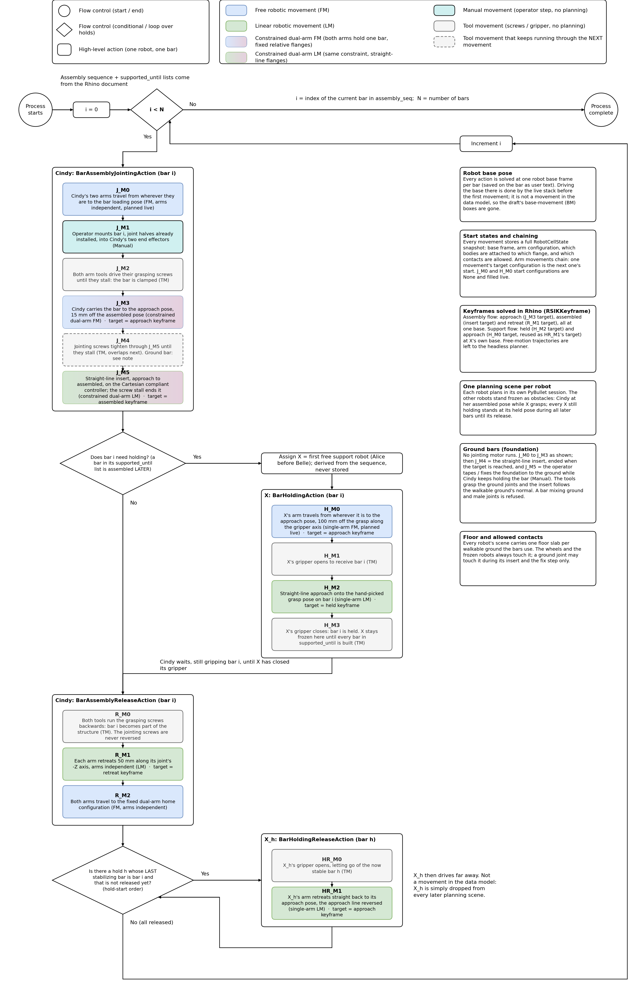

# Actions and movements: how they are implemented, and how the IK keyframe workflow uses them

Written 2026-09-30 against the working tree of branch `hs/mocap-experiment`
(`external/rs_data_structure` at commit `8912325`). It is the "as built"
companion of `docs/support_ik_spec.md`: that file says what was planned, this
one says what the code does today and where to look.

The matching flowchart is `docs/action_flowchart_2026.png` (editable source
`docs/action_flowchart_2026.drawio`, both generated by
`docs/action_flowchart_2026.py`). Section 5 explains its notation and what
changed since the 2025 draft.

> **Updated 2026-10-02** for the exporter fixes D1-D9
> (`docs/support_export_issues_from_monitor.md`, plan
> `tasks/2026-10-02_support_export_fixes_plan.md`). In short: the release is
> ungrasp, retreat, home (no untighten); a ground bar runs no jointing motor and
> ends its jointing with the operator fixing the foundation; movements are found
> by NAME, not number; every cell uses the same body names and carries the
> obstacles and the floor; hold scenes show the held bar; a held bar's release
> shows its own holder; every exported sequence lists the real bars only. The
> sections below describe the new state.

---

## 1. The big picture in five sentences

1. One bar is assembled by **four kinds of high-level action**, run by up to
   three robots: Cindy (dual-arm assembly robot) joints the bar and later lets
   go of it; a support robot X (Alice or Belle, single arm) may grab the bar in
   between and hold it until its stabilizing bars exist, then let go.
2. Every action is an ordered list of **movements**. A movement is either an
   arm motion (free or straight-line, one arm or both arms locked to one bar),
   an operator step, or a tool event (screws or gripper). The Python class of
   the movement is its type; there is no separate "kind" field.
3. Every movement stores a **full snapshot of the planning scene at its
   start** (`start_state`, a compas_fab `RobotCellState`) plus its goal
   (`target_ee_frames` and / or `target_configuration`). Arm movements chain:
   one movement's goal configuration is the next one's start configuration.
4. The Rhino button `RSIKKeyframe` does **not** store movements. It builds
   them in memory, uses their `start_state` + `target_ee_frames` to solve a
   handful of **keyframe configurations**, and writes only those configurations
   (plus the robot base frame) onto the bar curve as user text.
5. The export commands **rebuild** the movements from the cached robot cell
   and that user text, wrap them in actions, and write one JSON file per action
   plus a global `ActionSchedule.json` that interleaves all robots' actions.

---

## 2. The data classes (`external/rs_data_structure`)

The package holds data classes only. It is shared as a git submodule by this
repo (producer), `husky-assembly-teleop` (execution) and `husky_assembly_tamp`
(planner), so the three sides agree on the JSON. Everything derives from
`compas.data.Data`, so `json_dump` writes a `dtype` such as
`rs_data_structure.bar_action/BarAssemblyJointingAction` and the consumer can
rebuild the object.

### 2.1 `Movement` (base class, `bar_action.py`)

| Field | Type | Meaning |
| --- | --- | --- |
| `movement_id` | str | Unique id `<bar>_<kind>_M<n>_<name>`, e.g. `B4_J_M5_LM_insert`. The number is only the position (it differs between normal and ground bars), so builders and viewers find a movement by its kind + NAME (`bar_action.movement_by_name`). |
| `tag` | str | Human-readable label. For a `ManualMovement` this is the operator instruction. |
| `start_state` | `RobotCellState` | Full scene snapshot at the movement's start: robot base frame, arm configuration (may be `None`), every rigid body's pose / hidden flag / attachment, allowed contacts. |
| `target_ee_frames` | dict | Cartesian goals keyed by arm: `{"left": Frame, "right": Frame}` for Cindy, `{"arm": Frame}` for a support robot. Empty for tool / manual movements and for pure joint-space goals. |
| `target_configuration` | `Configuration` or `None` | Goal joint configuration. `None` means "not solved yet". |
| `trajectory` | `JointTrajectory` or `None` | Planned path. Always `None` on the Rhino side; the headless planner fills it. |
| `notes` | dict | Free-form hints for humans and for the planner (`approach_offset_mm`, `planner_fills`, `unplanned_offline`, ...). |
| `controller` | str | Which low-level controller runs it: `joint_tracking` (default), `cartesian_compliant` (only the insert), or `none` (manual / tool). |

### 2.2 Concrete movement classes

The class name encodes two things: **who moves** (both arms independently,
both arms locked to one bar, one support arm, nobody) and **motion type**
(free through joint space, or a straight line of the flange).

| Class | Who moves | Motion type | Used as |
| --- | --- | --- | --- |
| `IndependentDualArmFreeMovement` | Cindy, arms independent | free | J_M0 (to loading pose), R_M2 (to home) |
| `EndEffectorConstrainedDualArmFreeMovement` | Cindy, both arms hold the bar (fixed left-to-right flange transform) | free | J_M3 (transfer to approach) |
| `EndEffectorConstrainedDualArmLinearMovement` | same constraint | straight line | `LM_insert` (J_M5 on a normal bar, J_M4 on a ground bar) |
| `IndependentDualArmLinearMovement` | Cindy, arms independent | straight line | R_M1 (retreat) |
| `SingleArmFreeMovement` | support robot arm | free | H_M0 (to approach) |
| `SingleArmLinearMovement` | support robot arm | straight line | H_M2 (approach onto grasp), HR_M1 (retreat) |
| `ManualMovement` | operator | none | J_M1 (mount the bar); on a ground bar also J_M5 (fix the foundation to the ground) |
| `ScaffoldingToolMovement` (a `ToolMovement`) | Cindy's two arm tools | none | J_M2 (grasp), J_M4 (tighten, normal bars only), R_M0 (ungrasp) |
| `GripperToolMovement` (a `ToolMovement`) | support gripper | none | H_M1, H_M3, HR_M0 |

`ToolMovement` adds three fields: `tool_action` (`grasp`, `ungrasp`,
`tighten`, `open`, `close`; the jointing screws are never run backwards),
`tool_names` (e.g. `["AT3L", "AT3R"]` or `["SupportGripper"]`), and
`overlaps_next` (True only on a normal bar's tighten step: the jointing screws
keep turning during the whole insert until they stall). The grasp and ungrasp
steps name both arm tools; the tighten step names only the tools whose male
joint has its receiver (Female or MoCap half) in the scene. On a one-sided bar
the other male's receiver sits on a staging (fake) bar, so that male is only a
grasp point and the tighten step names one tool (issue D10). Manual
and tool movements still carry a full `start_state`, so any single movement
can be replayed or inspected on its own.

### 2.3 `Action`, `BarSceneAction`, and the four concrete actions

`Action` groups movements and names **the one robot** that executes them
(`action_id`, `tag`, `movements`, `robot_id`). `BarSceneAction` adds the
scene-building inputs every bar action needs:

| Field | Meaning |
| --- | --- |
| `active_bar_id` | The bar this action is about (the assembled bar, or the held bar). |
| `assembly_seq` | Every bar id in assembly order. The planner takes the prefix before `active_bar_id` as "already built". |
| `walkable_ground_ids` | Which `WalkableGround` surfaces this robot's base may stand on (meshes shipped separately in `WalkableGround.json`). |

| Action class (module) | Robot | Action id | Movements | Extra fields |
| --- | --- | --- | --- | --- |
| `BarAssemblyJointingAction` (`bar_action.py`) | Cindy | `<bar>_J_joint` | J_M0 … J_M5 (normal and ground shapes) | none |
| `BarAssemblyReleaseAction` (`bar_action.py`) | Cindy | `<bar>_R_release` | R_M0 … R_M2 | none |
| `BarHoldingAction` (`hold_action.py`) | Alice or Belle | `<bar>_H_hold` | H_M0 … H_M3 | `gripper_kind` (`"Robotiq"`), `supported_until` (copied from the bar) |
| `BarHoldingReleaseAction` (`hold_action.py`) | same robot | `<bar>_HR_hold_release` | HR_M0, HR_M1 | `released_after_bar_id` (the last stabilizing bar) |

The release action has **three** movements, as in the spec: the grasping
screws unclamp the bar (R_M0), then the arms retreat and go home. There is no
untighten step: the tightened jointing screw is what keeps the joint.

### 2.4 The movement roster, with what each start state contains

The tables below are the implementation truth for each action. "Config"
is `start_state.robot_configuration`; "attached" says which bodies ride on a
flange in that snapshot. The Rhino-side builders are described in section 3.

**Cindy: `BarAssemblyJointingAction`** (built by `core.bar_action.build_split_assembly_movements`)

| Id | Class | Start config | Bar + its joint halves | Goal | Who fills the goal config |
| --- | --- | --- | --- | --- | --- |
| J_M0 `free_to_load` | IndependentDualArmFree | `None` (real pose known only live) | detached, parked at the assembled world pose as a placeholder | none at build; back-filled with J_M3's start config | live monitor |
| J_M1 `manual_mount_bar` | Manual | `None` (copy of J_M3's start) | attached | n/a | n/a |
| J_M2 `tool_grasp_bar` | ScaffoldingTool `grasp` | `None` (copy of J_M3's start) | attached | n/a | n/a |
| J_M3 `CDFM_transfer_to_approach` | EndEffectorConstrainedDualArmFree | `None` (planner decides the loading pose) | attached to tool0: bar + carried females on the left flange, each male on its own arm | `target_ee_frames` = approach flanges; `target_configuration` = **approach keyframe** | RSIKKeyframe |
| J_M4 `tool_tighten_joint` | ScaffoldingTool `tighten`, `overlaps_next=True`; `tool_names` = the arms whose male has its receiver (Female or MoCap) in the scene (one tool on a one-sided bar) | approach keyframe (copy of J_M5's start) | attached | n/a | n/a |
| J_M5 `LM_insert` | EndEffectorConstrainedDualArmLinear, `cartesian_compliant`, `notes["ends_on"] = "tool_stall_signal"` (all of J_M4's tools stalled; also listed in `notes["stall_tools"]`) | approach keyframe | attached; mate contacts allowed | `target_ee_frames` = assembled flanges (the placed tool blocks); `target_configuration` = **assembled keyframe** | RSIKKeyframe |

**Ground bar** (two ground joints, no male joint; no jointing motor runs). J_M0
to J_M3 as above, then:

| Id | Class | Start config | Bar + its joint halves | Goal | Who fills the goal config |
| --- | --- | --- | --- | --- | --- |
| J_M4 `LM_insert` | EndEffectorConstrainedDualArmLinear, `cartesian_compliant`, `notes["ends_on"] = "target_reached"` | approach keyframe | attached; the ground joints may touch the floor | as on a normal bar | RSIKKeyframe |
| J_M5 `manual_fix_foundation` | Manual | assembled keyframe | attached (the robot keeps holding while the operator tapes / fixes the foundation); ground joints may touch the floor | n/a | n/a |

A bar mixing a ground joint and a male joint is refused (not a valid design).

**Cindy: `BarAssemblyReleaseAction`** (same builder)

| Id | Class | Start config | Bar + joint halves | Goal | Who fills |
| --- | --- | --- | --- | --- | --- |
| R_M0 `tool_ungrasp_bar` | ScaffoldingTool `ungrasp` | assembled keyframe (copy of R_M1's start) | detached, static at the assembled pose | n/a | n/a |
| R_M1 `LM_retreat` | IndependentDualArmLinear | assembled keyframe | detached | `target_ee_frames` = each flange moved 50 mm along its own joint block's -Z; `target_configuration` = **retreat keyframe** | RSIKKeyframe |
| R_M2 `free_home` | IndependentDualArmFree | retreat keyframe (or `None` for bars solved before retreat existed) | detached | `target_configuration` = the fixed 12-joint home pose from `config.HUSKY_DUAL_ARM_HOME_CONF_12` | config |

For a held bar, the export also places the bar's own support robot at its held
configuration in all three release states, allowed to touch the bar it is
clamped onto (it grabbed the bar between the jointing and the release).

**Support robot X: `BarHoldingAction`** (built by `core.hold_action_builder.build_bar_holding_action`)

| Id | Class | Start config | Goal | Who fills |
| --- | --- | --- | --- | --- |
| H_M0 `free_to_approach` | SingleArmFree | `None` | `target_ee_frames["arm"]` = approach flange (grasp flange backed off 100 mm along its own -Z); `target_configuration` = **support approach keyframe** | RSIKKeyframe (support flow) |
| H_M1 `gripper_open` | GripperTool `open` | approach keyframe | n/a | n/a |
| H_M2 `LM_to_grasp` | SingleArmLinear | approach keyframe | `target_ee_frames["arm"]` = grasp flange (hand-picked grasp frame × `BAR_GRASP_TO_TOOL0["Robotiq"]`); `target_configuration` = **held keyframe** | RSIKKeyframe (support flow) |
| H_M3 `gripper_close` | GripperTool `close` | held keyframe | n/a | n/a |

**Support robot X: `BarHoldingReleaseAction`** (built by `build_bar_holding_release_action`)

| Id | Class | Start config | Goal | Who fills |
| --- | --- | --- | --- | --- |
| HR_M0 `gripper_open` | GripperTool `open` | held keyframe | n/a | n/a |
| HR_M1 `LM_retreat` | SingleArmLinear | held keyframe | `target_ee_frames["arm"]` = the approach flange; `target_configuration` = the **support approach keyframe** again (same line, reversed) | reused from the hold |

The release retreat therefore needs no keyframe of its own. What it does need
is a check that the held and approach configurations are still collision-free
in the **release-time** scene (all stabilizers built), which is the two-checkpoint
validation described in section 4.3.

### 2.5 Files on disk

| File | Content |
| --- | --- |
| `<root>/BarActions/<bar>__J.json`, `__R.json` | Cindy's two halves. Written for every bar, with a placeholder identity base and no configurations if the bar has no keyframe yet (so the headless solver can fill them). |
| `<root>/BarActions/<bar>__H.json`, `__HR.json` | The support actions, only for bars in the hold plan whose support keyframe is solved. Unsolved holds are reported, never silently skipped. |
| `<root>/ActionSchedule.json` | Pure metadata: `robots` (name, robot id, role), `assembly_seq` (real bars only), `holds` (held bar, robot, release-after bar), `schedule`, the flat interleaved list of `{index, action_id, type, bar_id, robot, file}` naming only files that were written, and `not_exported`, the files the schedule would name but the export did not write. Rebuilt from the document every time. |
| `RobotCell.json`, `RobotCell_<Alice/Belle>.json`, `WalkableGround.json` | The cells and ground meshes, written by the batch export only. Every cell uses the same body names (`bar_*`, `joint_*`, `obstacle_*`, `ground_*`) and carries the obstacles and one floor slab (`ground_<id>`) per walkable ground some bar uses. `WalkableGround.json` stays for the base sampler. |

---

## 3. Where the movements are built (`scripts/core`)

### 3.1 Cindy: `build_split_assembly_movements` (`core/bar_action.py`)

This is the **single place** where Cindy's nine movements come from. Both the
keyframe button and the export call it. Its inputs are:

- the cached static robot cell (`RSRebuildRobotCell`), which already contains
  every bar, joint half, obstacle and the two arm tools;
- the bar id, and the two placed **tool block instances** on the bar. Their
  world transforms are the flange (tool0) poses at the assembled keyframe;
- a base frame (the keyframe button passes identity because the solver
  overrides it; the export passes the saved one);
- optionally the saved approach / assembled / retreat per-arm configurations.

From that it derives everything a movement needs **without IK**:

- `prepare_assembly_collision_state` gives one template state: built bars
  visible and static, unbuilt bars hidden, the active bar a static obstacle,
  tools attached.
- `freeze_holding_robots` stamps every support robot that is holding a bar
  during this step into the template as an articulated obstacle at its held
  configuration (skipped with a loud note if that hold is not solved yet).
- `_set_active_attachments` re-classes the active bodies per movement: in
  the transfer and the insert (and the steps that copy their states) the bar
  tube and its carried females ride on the left flange and each male (or
  grasped ground joint) on its own arm; in the load move, the ungrasp, the
  retreat and the home move they are detached at the assembled world pose.
- `_apply_movement_touch_policy` writes the allowed-contact lists per
  movement (male with its tool, bar with both tools while gripped, male with
  its mate and the mate's bar during the insert, a ground joint with the floor
  during the insert, cradle mates, ...). Together with the floor's own
  allowances (wheels, frozen robots) this is the only "allowed collision
  matrix" the pipeline authors.
- Targets are pure geometry: the approach flanges are the assembled flanges
  moved 15 mm (`LM_APPROACH_DISTANCE`) against the averaged tool z axis (or
  along the walkable ground normal for a ground bar); the retreat flanges are
  the assembled flanges moved 50 mm (`LM_RETREAT_DISTANCE`) along each
  arm's joint block -Z; the home configuration is a config constant.

The saved configurations are then stamped into the chain: approach into
the transfer's target and the insert's start; assembled into the insert's
target and the ungrasp / retreat start (and a ground bar's fix step); retreat
into the retreat's target and the home move's start. The manual and tool
events are snapshots cloned from the neighboring arm movements
(`assemble_timeline`, which also numbers the ids).

`build_bar_assembly_actions` wraps the two halves into the two action
objects, reading the keyframe user text off the bar and the assembly order
(real bars only) and walkable-ground ids off the document. For a held bar it
then places the bar's own holder in the release states (see the roster above).

### 3.2 Support robot: `core/hold_action_builder.py`

The two holding builders read the five `KEY_SUPPORT_*` user-text keys off the
**held** bar (section 4.3) and build the scene in the support robot's own cell:

- `get_env_union` registers every bar, joint and static body (obstacles,
  floors) once, under the same names as Cindy's cell; each scene then only
  toggles `is_hidden` per bar / joint (no cell re-upload when switching scenes).
- `collect_hold_window_geometry` picks the **release-time built set**: every
  bar up to and including the last stabilizer, the held bar included. A hold
  pose must survive the whole hold window, and since bars only accumulate,
  the end of the window is the binding scene.
- `build_hold_scene_state` (shared by the interactive solve, the batch
  re-solve and `build_bar_holding_action`) freezes Cindy at her assembled
  pose for that bar (she is still gripping it) and every other support robot
  holding at that step, then sets the allowed contacts: Cindy with the held
  bar, its joints and its males' mate females; each frozen robot with the
  bars built after it leaves (they never stand next to it, but the
  release-time scene shows them). The support gripper may touch the held bar
  only from the linear approach on (H_M2, H_M3, HR_M0, HR_M1), so the free
  approach is checked against it; the held pose is solved with that contact
  allowed and the approach pose without it (`solve_hold_pair`).
- `build_bar_holding_release_action` uses `build_release_scene_state`, where
  Cindy is parked (she has left) and the other holds still in place are frozen
  (`hold_schedule.holds_present_at_release`: a hold released earlier in the
  same step is already gone).
- `approach_tool0_from_grasp` backs the grasp flange off 100 mm
  (`SUPPORT_LM_DISTANCE_MM`) along its own -Z; that one frame is the goal of
  H_M0 and the start of H_M2, and again the goal of HR_M1.

### 3.3 Who holds what, and the global order: `core/hold_schedule.py`

This module is Rhino-free and re-derives everything from two dictionaries
(`bar_seq`, `supported_until`) on every call, so nothing about occupancy is
ever stored:

- A bar needs a hold if at least one bar in its `supported_until` list is
  assembled **later**; its hold releases right after the **last** such bar's
  assembly release. Listed bars that come earlier contribute nothing.
- A support robot is busy from its hold's start step through the release step
  **inclusive**, so it cannot take a new hold at the release step itself.
- When more than one robot is free, the first in `config.SUPPORT_ROBOT_NAMES`
  (`("Alice", "Belle")`) is chosen. If none is free, `derive_hold_plan`
  raises and names who holds what, so the sequence can be revisited in
  `RSSequenceEdit`.
- `build_action_schedule` turns that into the interleaved order the flowchart
  shows: per bar, Jointing; Holding (if needed); Release; then every
  HoldingRelease whose last stabilizer is this bar, in hold-start order. For
  the spec's demo this gives exactly the eight step lists in
  `support_ik_spec.md` section 4.

---

## 4. How the IK keyframe workflow uses them (`scripts/rs_ik_keyframe.py`)

### 4.1 One button, two flows

`_detect_flow` routes the picked bar: if the bar needs holding (non-empty
`supported_until`) **and** its assembly keyframe is already complete
(`has_ik_keyframe`: base, approach and assembled keys present), the user is
asked which keyframe to solve, with Support as the default. In every other
case the assembly flow runs. Either flow can be redone by clicking the bar
again. The support flow needs no tool blocks on the bar; the assembly flow
needs exactly one left and one right tool block, otherwise the offending
joints are painted pink and the pick is rejected.

### 4.2 Assembly flow, step by step

1. **Resolve the two tool blocks** on the bar; draw the base guide lines and
   re-derive which end carries the left tool from the guide heading.
2. **Build all nine movements** with `build_split_assembly_movements`
   (identity base, no saved configurations). Only four of them matter to the
   solver, and they are re-labelled with the old role names so the solve code
   stayed unchanged:

   | Solver role | Movement | What is solved |
   | --- | --- | --- |
   | M1 | `CDFM_transfer_to_approach` | approach configuration (from `target_ee_frames`) |
   | M2 | `LM_insert` | assembled configuration |
   | M3 | `LM_retreat` | retreat configuration |
   | M4 | `free_home` | nothing; its `target_configuration` (home) is only shown in the preview |

3. **Pick the base**: reuse the saved base, pick a new point on a
   `WalkableGround` brep plus a heading, or flip the saved one. The base is
   written to the bar immediately. An off-ramp lets the user stop here and
   run the slow solve headlessly (`headless_bar_action_planner.py --solve-keyframes --base saved`).
4. **Solve the chain** with `_solve_chain_with_sampling`, a Rhino wrapper
   around the shared `husky_assembly_tamp.keyframe.ik_keyframe.solve_keyframe_chain`.
   For each movement in order it copies the `start_state`, seeds the
   configuration with the previous movement's solution (cold random restarts
   for the first one), and solves dual-arm IK for the `target_ee_frames` at
   the candidate base. A base is accepted only when **all three** solve. On
   failure the base is re-sampled on a 1000 mm circle (up to 10 samples,
   `IK_BASE_SAMPLE_*`), each sample snapped back onto the ground brep, with a
   ghost robot showing every attempt.
5. **Preview and decide**: step through approach / assembled / retreat /
   home; accept, retry the same base, retry a new base, inspect the failing
   IK candidates (ssik backend only), or give up.
6. **Accept writes four user-text keys** on the bar curve, and nothing else:

   | Key | Content | Feeds |
   | --- | --- | --- |
   | `assembly_robot_base_frame_world_mm` | 4×4 base frame, mm | every movement's `start_state.robot_base_frame` |
   | `assembly_ik_approach` | `{left: {joint_names, joint_values}, right: {...}}` | transfer target, tighten + insert start |
   | `assembly_ik_assembled` | same shape | insert target, fix-foundation (ground bar) + ungrasp + retreat start |
   | `assembly_ik_retreat` | same shape (optional for old bars) | retreat target, home start |

7. **Checkpoint 2 of the release validation** runs right after the accept:
   if this bar is the last stabilizer of any hold, every such hold's held and
   approach configurations are re-checked against the now fully known
   release scene (`validate_releases_after_bar`). Failures are reported, the
   accepted keyframe is never rolled back.

The movement objects built in step 2 are thrown away when the command ends.
The exported JSON is rebuilt from the cell plus the four keys, which is why
the builder must be callable both before and after IK exists.

### 4.3 Support flow, step by step

1. **Hold plan**: `derive_hold_plan` decides which robot X holds this bar and
   until after which bar. If the bar is not in the plan (all stabilizers are
   earlier), the command stops with a message.
2. **X's own PyBullet session** is started or reused
   (`robot_cell_support.ensure_support_cell_pushed`). Each robot has its own
   calibrated URDF, so a keyframe solved for Alice cannot be reused for Belle;
   the robot name is stored with the keyframe and checked at build time.
3. **Scene**: `build_hold_scene_state` (section 3.2): the release-time built
   set with the held bar shown, Cindy frozen at her assembled keyframe (read
   from the bar's assembly keys, which must exist), any other holding robot
   frozen at its held keyframe, and the frozen robots' allowed contacts. The canvas is focused
   on this step (later bars hidden, other bars' tool blocks hidden, the bar's
   own stabilizers shown in purple).
4. **Grasp pick**, by hand, with a ghost gripper on the cursor
   (`support_grasp_pick.pick_grasp_frame_on_bar`): first the grasp center on
   the bar centerline, then the gripper's pointing direction in the plane
   perpendicular to the bar. Written to the bar immediately
   (`support_grasp_frame_world_mm`). Grasps are never generated automatically.
5. **Base pick** on a `WalkableGround` brep with X's ghost robot; written
   immediately (`support_robot_base_frame_world_mm`).
6. **Solve held then approach** with `_solve_support_pair_with_sampling`:
   IK for the flange at the grasp (held, gripper allowed to touch the held
   bar), then IK for the approach flange (gripper NOT allowed to touch it)
   seeded from the held configuration so both sit on the same IK branch; both
   must succeed at the same base. Base sampling on failure is the same circle
   as the assembly flow.
7. **Checkpoint 1** (`validate_release_confs`, partial mode): both
   configurations are collision-checked in the release scene; overlapping
   holds that are not solved yet are skipped with a note. Planning for X stops
   here on purpose: it stays frozen in the grasp for many steps.
8. **Accept writes the remaining keys** (all five together form one keyframe;
   the reader is all-or-nothing and raises on a partial set):

   | Key | Content | Feeds |
   | --- | --- | --- |
   | `support_robot_name` | `"Alice"` or `"Belle"` | `robot_id` of both hold actions; assignment check |
   | `support_robot_base_frame_world_mm` | 4×4, mm | every H / HR movement's base |
   | `support_grasp_frame_world_mm` | 4×4, mm | H_M2 goal frame (× grasp-to-tool0), and the approach frame derived from it |
   | `support_ik_approach` | `{joint_names, joint_values}` | H_M0.target, H_M1 / H_M2.start, HR_M1.target |
   | `support_ik_held` | same shape | H_M2.target, H_M3.start, HR_M0 / HR_M1.start; and X's frozen pose in everyone else's scenes |

### 4.4 Batch and export commands

- `RSIKKeyframeAll` (right-click) places a base for several bars at once
  (standoff behind the grabbed-joint center, on the ground, facing the bar),
  solves each chain once at that base without sampling, then runs a
  **support pass**: every hold whose grasp and base picks are already stored
  is re-solved without UI at the stored base
  (`resolve_support_keyframe_noninteractive`); holds without picks are listed
  for the interactive button.
- `RSExportBarAction` writes `__J` and `__R` for one bar, plus `__H` and
  `__HR` when the bar is in the hold plan and solved, and refreshes
  `ActionSchedule.json` if one exists. `RSExportAllBarActions` does the same
  for every bar in order and also writes the cells, the ground meshes and the
  schedule. Both rebuild the movements from scratch through the builders in
  section 3.
- `RSLoadSolvedBarAction` / `RSShowBarActionPlan` go the other way: they read
  headless-solved JSON back into Rhino, sync the keyframe user text from the
  movements' configurations, and animate the trajectories.

### 4.5 What is deliberately not solved in Rhino

| Movement | Why it is left open |
| --- | --- |
| J_M0, H_M0 (start), R_M2 home (path) | The robot's real starting configuration is only known live. Their goal is the next movement's start; the live monitor or headless planner plans the path. |
| mount, grasp, tighten / fix foundation, ungrasp, H_M1, H_M3, HR_M0 | No arm motion. They are timeline events with a snapshot state. |
| Every `trajectory` | Motion planning (RRT etc.) is the headless planner's job in `husky_assembly_tamp`. Rhino solves keyframe configurations only. |
| Base driving | Not a movement at all. Each action carries one base frame; the live stack drives there before the first movement. |

---

## 5. The flowchart (`docs/action_flowchart_2026.*`)

Notation, following the SCF 2021 paper and the 2025 draft:

- circles = start / end; rhombi = conditionals and loops; rounded white
  containers = one high-level action of one robot on one bar;
- blue = free robotic movement (FM), green = linear robotic movement (LM),
  a blue or green box fading to purple = both arms locked to one bar
  (the "constrained dual-arm" movements), teal = manual movement, grey = tool
  movement, dashed grey = a tool movement that keeps running through the next
  movement (the tighten step of a normal bar);
- every movement box carries its code id and, where the Rhino button solves
  it, which keyframe becomes its target.

What changed compared with `action_flowchart_draft_2025.drawio.png`:

1. **Base movements (BM, yellow) are gone.** The data model has no base
   movement; the base pose is a per-bar keyframe input.
2. **Cindy's cycle is split into two actions** (jointing, release) so the
   release can wait for a support robot. The tightening screws became their
   own tool movement (J_M4) that overlaps the insert instead of the draft's
   combined "LM + TM" box. The release starts directly with the ungrasp
   (R_M0); the jointing screws are never run backwards.
3. **The "foundation bar" branch is back** (2026-10-02): a ground bar runs no
   jointing motor; after the insert the operator fixes the foundation to the
   ground while the robot holds the bar (`manual_fix_foundation`), then the
   normal release follows. The "two joints to existing structure" branch is
   simply the normal bar.
4. **The support-robot branch is now two actions** on a derived robot X, and
   the "previously supported bar no longer needs support" conditional became
   a loop over every hold whose last stabilizer is the current bar, run after
   Cindy's release.
5. Support robots leave the scene after release; there is no "base transit
   home" for them.

Regenerate with `python docs/action_flowchart_2026.py` (plain Python with
matplotlib). Editing the `.drawio` in draw.io is fine too; the script is the
source of truth only until you edit by hand.

---

## 6. The spec's open points, as the code stands

| Open point in `support_ik_spec.md` §7 | What the code does now |
| --- | --- |
| 1. When is the release retreat keyframe solved? | Never separately: HR_M1's goal is the hold's approach configuration. Instead the held and approach configurations are validated in the release scene at checkpoint 1 (partial, after the hold solve) and checkpoint 2 (full, when the last stabilizer's assembly keyframe is accepted). |
| 2. `RSIKKeyframeAll` behaviour | One assembly pass over the selected bars, then one support pass over every hold with stored picks, in hold-start order. |
| 3. What "available" means | Derived on every call by `derive_hold_plan`: busy from hold start through the release step inclusive; first free name in `SUPPORT_ROBOT_NAMES`. No user override exists. |
| 6. Home pose for the assembly release | `config.HUSKY_DUAL_ARM_HOME_CONF_12`, global, stamped into the home move's (R_M2) `target_configuration`. |
| 7. Encoding overlapping movements | The `overlaps_next` flag on `ToolMovement`, set on a normal bar's tighten step only. |
| 8. Where released support robots go | Nowhere modeled: after HR_M1 the robot is simply absent from every later scene. |
| 9. Which holding movements get keyframes | Confirmed: held (H_M2 goal) from the hand-picked grasp, approach (H_M0 goal) derived by the 100 mm offset; H_M0's path is left to the planner. |
| 4, 5, 10 (demo screenshots) | Unchanged; they concern the demo images, not the code. |

Two things worth knowing that are not in the spec:

- While Cindy's jointing keyframes for bar i are solved, the robot that will
  grab bar i **mid-step** is not in her scene (it only arrives after the
  insert). The export adds it to bar i's release states afterwards, so the
  exported release scenes are complete; the retreat keyframe solve itself
  still does not see it.
- A hold that exists in the plan but is not solved yet is **skipped with a
  printed note** in Cindy's scene, so a bar solved before its holder was
  keyframed should be re-solved afterwards (the note says so).
