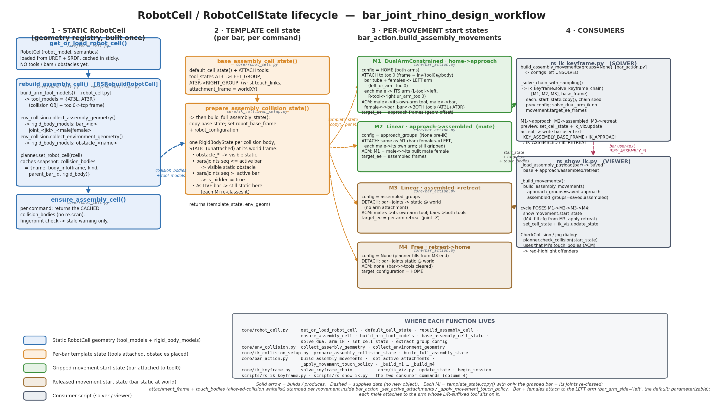
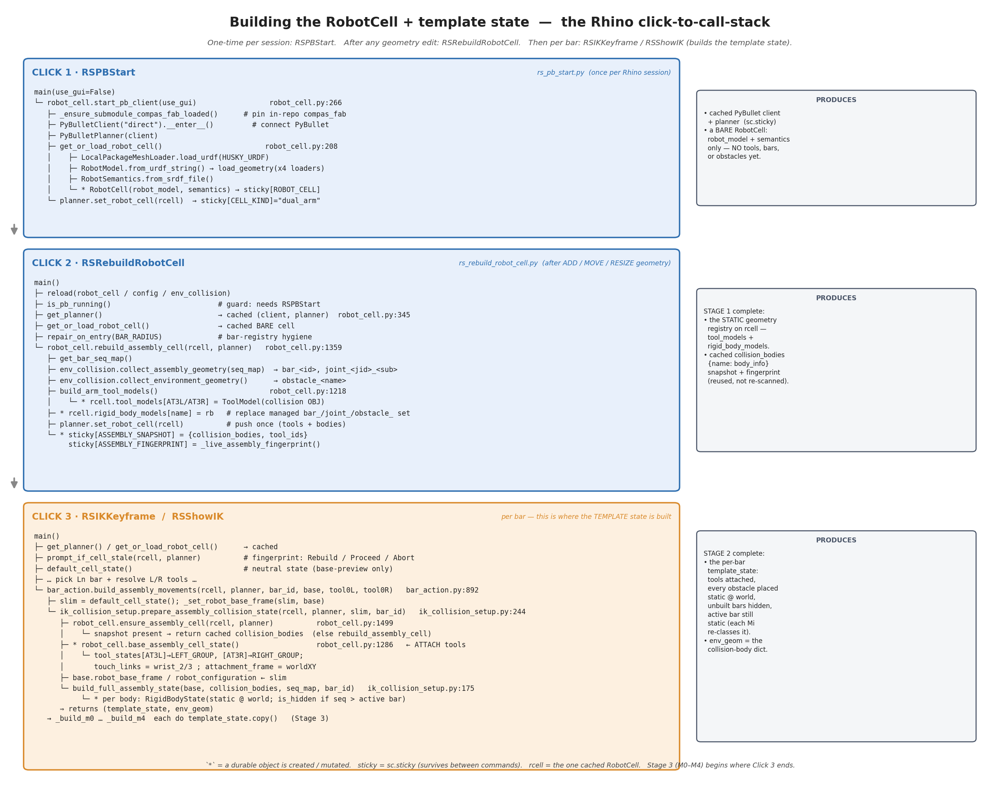

# IK Keyframe Scene Reconstruction

*How `RSIKKeyframe` turns Rhino geometry into a collision-aware dual-arm scene, solves the assembly IK chain, and writes the result back on the bar.*

This report documents the scene-reconstruction pipeline behind
`scripts/rs_ik_keyframe.py` and the BarAction headless workflow in
`tests/headless_bar_action_planner.py`:

1. **Scene creation** — building the static `RobotCell` (robot + tools + all bars,
   joints, and obstacles) once per geometry edit.
2. **Geometry fetching from Rhino + naming conversion** — how bars, joint halves,
   and obstacle meshes are read out of the Rhino document and given
   state-independent canonical names.
3. **Scene reconstruction for IK keyframing** — how a per-bar *template* cell state
   and then five per-movement start states (M0–M4) are stamped on top of the static
   cell, each re-classing the grasped bar and setting its own attachments and
   allowed-collision policy.
4. **ACM management** — exactly which body↔body / body↔tool contacts are
   whitelisted for each movement, and why.

Everything below refers to real functions and line numbers as they stand today
(`scripts/core/…`). Two companion diagrams are generated by
`docs/robotcell_state_lifecycle.py` and `docs/robotcell_build_callstack.py`; run
either with a plain (non-Rhino) Python that has matplotlib to regenerate the PNGs.

> **Diagram status (July 2026):** the checked-in diagram sources/PNGs still carry
> the former `RSShowIK` name, and the build-callstack diagram still shows the
> pre-auto-build three-click startup. The corrected text and audit table in this
> report are authoritative until those diagrams are updated and regenerated.

---

## 1. The big picture: four stages

The data flow has four stages. A body of geometry becomes a **static registry**
(built once), then a **template state** (per bar), then **five movement start
states** (per bar), which two consumer scripts read.



| Stage | What it is | Built by | Lives in |
|---|---|---|---|
| 1 · Static `RobotCell` | Geometry registry: robot model + 2 arm tools + every bar/joint/obstacle as a `RigidBody` | `robot_cell.rebuild_assembly_cell` | `sc.sticky` (one cached cell + a `collision_bodies` snapshot) |
| 2 · Template cell state | One `RobotCellState`: tools attached, obstacles placed static, unbuilt bars hidden | `ik_collision_setup.prepare_assembly_collision_state` | rebuilt per command (not cached) |
| 3 · Per-movement states | M0–M4, each a `template_state.copy()` that re-classes the grasped bar + sets its ACM | `bar_action.build_assembly_movements` | the `BarAssemblyAction` (in memory; exported to JSON) |
| 4 · Consumers | Solver (`rs_ik_keyframe`), viewer (`rs_show_bar_action_plan`), solved-action loaders, and headless tools | — | write/read bar user-text and solved BarAction sidecars |

Two guiding principles run through the whole thing:

- **State-independent canonical names.** The cell is a *static registry*: every
  body has one fixed name (`bar_<id>`, `joint_<jid>_<sub>`, `obstacle_<name>`;
  tools `AT3L`/`AT3R`) regardless of which bar is being assembled. The bar being
  assembled is identified by `active_bar_id` + the assembly sequence, **not** by a
  name prefix. There is no `active_*` / `env_*` renaming step.
- **Build-full, re-class-active.** Every per-movement state is a full copy of the
  template, and only the grasped bar + its joint halves are re-classed (attached to
  a gripper in M1/M2, detached to world in M0/M3/M4). Every other body stays a
  static obstacle at its world pose.

---

## 2. The Rhino click-to-callstack

The user-facing startup path normally needs two clicks: `RSPBStart` starts
PyBullet **and immediately attempts Stage 1**, then `RSIKKeyframe` or
`RSShowBarActionPlan` builds the per-bar states. `RSRebuildRobotCell` remains the
manual refresh after geometry edits or after startup's best-effort build failed.



| Click | Command | When | Produces |
|---|---|---|---|
| 1 | **RSPBStart** | once per Rhino session | cached PyBullet client + planner; low-level startup first loads the bare cell, then the command best-effort calls `rebuild_assembly_cell` to produce Stage 1 |
| 2 | **RSRebuildRobotCell** | after any add/move/resize, or if startup could not build | manual Stage 1 refresh: static geometry registry (`tool_models` + `rigid_body_models`) + cached `collision_bodies` snapshot and fingerprint |
| 3 | **RSIKKeyframe** / **RSShowBarActionPlan** | per bar | Stage 2: the per-bar template state, then Stage 3: M0–M4 |

---

## 3. Stage 1 — Static `RobotCell` scene creation

Source: `scripts/core/robot_cell.py`.

### 3.1 The bare low-level cell — `get_or_load_robot_cell()` (line 208)

Loads the robot once and caches it under the sticky key `bar_joint:robot_cell`.

- Sets `compas.PRECISION = "12f"`.
- Builds **four** `LocalPackageMeshLoader`s over the URDF package
  (`config.HUSKY_PKG_PATH` = `asset/husky_urdf`), one per mesh package:
  `mt_husky_dual_ur5_e_moveit_config`, `husky_description`,
  `husky_ur_description`, `ur_description`.
- `load_urdf(config.HUSKY_URDF_FILENAME)` →
  `RobotModel.from_urdf_string(...)` → `robot_model.load_geometry(<4 loaders>)`.
  The URDF is the **calibrated** `husky_dual_ur5_e_no_base_joint_All_Calibrated.urdf`.
- `RobotSemantics.from_srdf_file(config/dual_arm_husky.srdf)`.
- `RobotCell(robot_model, robot_semantics)` — **no tools, bars, or obstacles yet.**

`start_pb_client()` (line 266) wraps this: connect PyBullet, make a
`PyBulletPlanner`, load the bare cell, `planner.set_robot_cell(rcell)`, and mark
the cell kind `"dual_arm"` in sticky. The **toolbar command** `RSPBStart` then
calls `_auto_build_robot_cell`, which invokes `rebuild_assembly_cell` immediately.
Thus "bare cell" describes the low-level intermediate state, not the usual
post-command state seen by the user. If the auto-build fails, PyBullet remains
running and the user can run `RSRebuildRobotCell` later.

### 3.2 The geometry registry — `rebuild_assembly_cell(robot_cell, planner)` (line 1631)

This is where the scene gets its geometry. It:

1. `seq_map = get_bar_seq_map()` — the assembly-sequence map `{bar_id: (oid, seq)}`.
2. `collision_bodies = collect_assembly_geometry(seq_map)` then
   `.update(collect_environment_geometry())` (both in `core.env_collision`; see §4).
   This is a `{name: body_info}` dict covering every bar, joint half, and obstacle.
3. `build_arm_tool_models()` (line 1490; see §3.3) → assign each `ToolModel` into
   `robot_cell.tool_models[tid]` (`AT3L`, `AT3R`).
4. **Replace the managed rigid bodies.** It pops any stale body whose name starts
   with `bar_` / `joint_` / `obstacle_` and re-inserts `body_info["rigid_body"]`
   for every current body (lines 1404–1418):

   ```python
   managed_prefixes = (CANONICAL_BAR_PREFIX, CANONICAL_JOINT_PREFIX, OBSTACLE_PREFIX)
   desired = {name: bi["rigid_body"] for name, bi in collision_bodies.items()}
   existing_managed = {n for n in robot_cell.rigid_body_models if n.startswith(managed_prefixes)}
   for stale in existing_managed - set(desired):
       robot_cell.rigid_body_models.pop(stale, None)
   for name, rb in desired.items():
       robot_cell.rigid_body_models[name] = rb
   ```
5. `planner.set_robot_cell(robot_cell)` — pushes tools + bodies to PyBullet once.
6. Caches the snapshot + fingerprint (see §3.5).

**Only the `rigid_body` geometry is mirrored into the cell.** The rest of each
`body_info` (`frame_world_mm`, `kind`, `parent_bar_id`, …) is kept in the
`collision_bodies` snapshot and consumed later by `build_full_assembly_state` to
place each body in the world.

### 3.3 The two arm tools — `build_arm_tool_models()` (line 1490)

Reads the robotic-tool registry (`robotic_tools.json` via `core.robotic_tool`),
buckets tools by their name's L/R suffix (one left + one right required), and for
each builds a `ToolModel` (lines 1261–1282):

```python
mesh = Mesh.from_obj(col_path)     # tdef.collision_path(): per-tool collision OBJ
mesh.scale(0.001)                  # OBJ exported in mm -> meters
tcp_frame = _mm_matrix_to_m_frame(Frame, tdef.M_tcp_from_block)  # tool0_from_tcp
tool_model = ToolModel(None, tcp_frame, None, tdef.name)         # name = AT3L / AT3R
tool_model.add_link("attached_tool_link", visual_meshes=[mesh], collision_meshes=[mesh])
```

- The collision OBJ is used as **both** the visual and the collision mesh, on a
  single link named `attached_tool_link`.
- The tool's `frame` is the `tool0 → tcp` transform (`M_tcp_from_block`; the block
  was baked at the flange, so it is used as-is).
- The `ToolModel`'s name is the registry id (`AT3L` / `AT3R`) — this is what the
  attachment logic later matches on.

### 3.4 `default_cell_state()` (line 255) vs `base_assembly_cell_state()` (line 1558)

- `default_cell_state()` returns the cell's neutral state — **no tools attached**.
  Used only to preview the robot at a candidate base frame.
- `base_assembly_cell_state()` is the template seed **with the two arm tools
  attached** — covered in §5.1.

### 3.5 Staleness — snapshot + fingerprint

`rebuild_assembly_cell` writes two sticky entries (lines 1426–1436):

```python
_STICKY[_STICKY_ASSEMBLY_SNAPSHOT]    = {"collision_bodies": collision_bodies,
                                         "tool_ids": sorted(robot_cell.tool_models)}
_STICKY[_STICKY_ASSEMBLY_FINGERPRINT] = _live_assembly_fingerprint()
```

`_live_assembly_fingerprint()` (line 1593) is a cheap tuple:
`(n_bars, n_joint_instances, n_env_layer_objects, round(sum_of_bar_endpoint_coords, 3))`.

This is only a coarse change signal. It does **not** include joint transforms,
environment-mesh vertices/transforms, or the individual bar endpoints. Therefore
it can miss moved joints, edited/moved environment meshes, and bar edits whose
summed endpoint coordinates happen to cancel. It can also react to a non-mesh
object on the environment layer even though the collector skips that object.

- `ensure_assembly_cell(robot_cell, planner)` (line 1771) — called by
  `RSIKKeyframe` on every run. If no snapshot exists it rebuilds once; otherwise it
  returns the **cached** `collision_bodies` (no re-scan) and merely **warns** if the
  live fingerprint no longer matches. It never auto-rebuilds.
- `prompt_if_cell_stale(robot_cell, planner)` (line 1712) — if the fingerprint
  drifted and the user has not already acked it, prompts **Rebuild / Proceed /
  Abort**. This is the guard `RSIKKeyframe.main()` calls right after loading the
  cell.

### 3.6 The sticky cache keys

| Constant | String | Holds |
|---|---|---|
| `_STICKY_ROBOT_CELL` | `bar_joint:robot_cell` | the one cached `RobotCell` |
| `_STICKY_PB_CLIENT` / `_STICKY_PB_PLANNER` | `bar_joint:pb_client` / `…pb_planner` | PyBullet client + planner |
| `_STICKY_CURRENT_CELL_KIND` | `bar_joint:current_cell_kind` | `"dual_arm"` \| `"support"` |
| `_STICKY_ASSEMBLY_SNAPSHOT` | `bar_joint:assembly_cell_snapshot` | `{collision_bodies, tool_ids}` |
| `_STICKY_ASSEMBLY_FINGERPRINT` | `bar_joint:assembly_cell_fingerprint` | last-built fingerprint tuple |
| `_STICKY_ASSEMBLY_STALE_ACK` | `bar_joint:assembly_cell_stale_ack` | user "proceed with stale cell" ack |

---

## 4. Geometry fetching from Rhino + naming conversion

Source: `scripts/core/env_collision.py`. Rhino imports (`rhinoscriptsyntax`,
`Rhino`) are done lazily inside function bodies so the module stays importable
headless.

Three collectors feed the static cell:

- `collect_assembly_geometry(bar_seq_map)` (line 364) — **all** bars + their joint
  halves → `bar_*` / `joint_*`. This is the primary one used by
  `rebuild_assembly_cell`.
- `collect_environment_geometry()` (line 463) — static obstacle meshes →
  `obstacle_*`.
- `collect_built_geometry(active_bar_id, bar_seq_map)` (line 267) — the *single-arm
  support-cell* path (`env_bar_*` / `env_joint_*`); not used by the dual-arm
  assembly IK, listed here only to explain the two naming namespaces.

### 4.1 Naming conversion — the exact rules

Prefixes (lines 49–53): `CANONICAL_BAR_PREFIX = "bar_"`,
`CANONICAL_JOINT_PREFIX = "joint_"`, `OBSTACLE_PREFIX = "obstacle_"`.

| Body | Name | Source of the variable part |
|---|---|---|
| Bar | `bar_<bid>` | `<bid>` = the `bar_id` **key** of `bar_seq_map` (not read from user-text here) |
| Joint half | `joint_<jid>_<subtype>` | `<jid>` = `rs.GetUserText(oid,"joint_id")` (falls back to the object GUID); `<subtype>` lowercased |
| Obstacle | `obstacle_<name>` | `<name>` = sanitized `rs.ObjectName(oid)` (falls back to `env<i>`), de-duplicated with `_1`, `_2`, … |

The joint tag is built identically in both collectors:

```python
subtype = (rs.GetUserText(joint_oid, "joint_subtype")   # "Male" / "Female"
           or rs.GetUserText(joint_oid, "joint_type")   # ground joints -> "ground"
           or "Joint")                                   # last resort
tag = f"{joint_id or str(joint_oid)}_{subtype.lower()}"
out[f"{CANONICAL_JOINT_PREFIX}{tag}"] = { ... }
```

So typical names are `joint_J12_male`, `joint_J12_female`, `joint_J7_ground`. The
3-level `subtype` fallback exists because ground joints carry `joint_type="ground"`
but no `joint_subtype`, and we want the suffix to read `_ground` rather than a
meaningless `_joint`.

The obstacle name is sanitized by `_sanitize_obstacle_name` (line 447): every
character that is not alphanumeric / `-` / `_` becomes `_`; an empty result
becomes the literal `env`.

### 4.2 Geometry fetching — three different paths

Each kind of body is read from Rhino differently. Only obstacles are extracted as
actual Rhino meshes; bars are procedural and joints come from OBJ files.

**Bars — procedural cylinder in the bar-local frame + a world transform.**
`_bar_world_frame_mm(bar_oid)` (line 162) reads the curve endpoints
(`rs.CurveStartPoint` / `rs.CurveEndPoint`), scales them to mm, and builds a frame:
origin = start, Z = unit(end − start), X = `orthogonal_to(Z)`, Y = Z × X. This 4×4
is the body's `frame_world_mm`. The mesh itself (`_build_bar_cylinder_mesh`, line
124) is a fresh 12-sided (`BAR_CYLINDER_SIDES`) cylinder built **in meters** in the
local frame, radius `config.BAR_RADIUS = 10.0` mm. The bar's world pose rides on
the frame, not baked into the mesh.

**Joints — block instance transform + a mesh loaded from OBJ.** Joints are Rhino
block instances. `_block_instance_xform_mm(oid)` (line 251) coerces the object to a
`Rhino.DocObjects.InstanceObject`, reads `.InstanceXform`, and scales only the
translation column to mm — this is `frame_world_mm`. The mesh is loaded once per
`block_name` from the joint's collision OBJ (`Mesh.from_obj`,
`native_scale=0.001`), resolved through `core.joint_pair` (e.g. `asset/T20_Female.obj`).

**Obstacles — Rhino mesh extraction.** `collect_environment_geometry` iterates
`rs.ObjectsByLayer(config.LAYER_ENVIRONMENT)`, skips non-meshes with a warning, and
hand-copies vertices + faces:

```python
verts = rs.MeshVertices(oid); faces = rs.MeshFaceVertices(oid)
cverts = [(x*scale_to_m, y*scale_to_m, z*scale_to_m) for (x,y,z) in verts]
cfaces = [[a,b,c] if c == d else [a,b,c,d] for (a,b,c,d) in faces]  # Rhino tri: c==d
mesh = Mesh.from_vertices_and_faces(cverts, cfaces)
rb   = RigidBody(visual_meshes=[mesh], collision_meshes=[mesh], native_scale=1.0)
```

Because obstacle vertices are pre-scaled into **world meters** at extraction, the
obstacle's pose is baked into the mesh and its `frame_world_mm` is **identity**.

### 4.3 Unit conversion

The single source of the doc→mm factor is
`core.rhino_frame_io.doc_unit_scale_to_mm()`
(= `Rhino.RhinoMath.UnitScale(doc units → Millimeters)`).

| Body | Frame convention | `RigidBody.native_scale` |
|---|---|---|
| Bar | mesh in meters (local); `frame_world_mm` in mm | `1.0` |
| Joint | mesh from OBJ in mm; `frame_world_mm` = block xform (translation → mm) | `0.001` |
| Obstacle | mesh verts pre-scaled to world meters; `frame_world_mm` = identity | `1.0` |

The downstream state builder converts `frame_world_mm` back to a meters `Frame`
(origin ÷ 1000; rotation columns are unitless).

### 4.4 The `body_info` record

Every collector returns `{name: body_info}`. The union of keys:

| Key | Meaning | Present in |
|---|---|---|
| `rigid_body` | the `compas_fab.robots.RigidBody` (the only field mirrored into the cell) | all |
| `frame_world_mm` | 4×4 mm world pose (identity for obstacles) | all |
| `kind` | `"bar"` \| `"joint"` \| `"environment"` | all |
| `source_oid` | the Rhino object GUID | all |
| `parent_bar_id` | owning bar id | bars + joints (canonical path) |
| `block_name` | `rs.BlockInstanceName(...)` | joints |
| `subtype` | resolved `Male` / `Female` / `ground` / `Joint` | joints |

Note there is **no** `"assembly"` kind — assembly bodies are `"bar"` or `"joint"`;
only obstacles are `"environment"`. Whether a bar/joint is built / active / not-yet-
built is decided downstream from `parent_bar_id` + the assembly sequence, not from
`kind`.

### 4.5 Caching and de-duplication

- **Joint `RigidBody`** cached by `block_name` (sticky
  `bar_joint:env_joint_rb_cache`) — one shared instance per block definition across
  all placements. A missing OBJ writes `None` into the cache, but the current
  `cache.get(...) is not None` lookup does not recognize that as a cache hit, so a
  missing OBJ is re-probed on later calls (known negative-cache bug).
- **Bar `RigidBody`** cached by `str(guid)` with a `(round(length,3),
  round(radius,3))` signature (sticky `bar_joint:env_bar_rb_cache`) — rebuilt only
  when length or radius changes. A pure move reuses the local cylinder mesh; its
  world frame is refreshed only when the assembly scene itself is rebuilt.
- **Obstacle names** de-duplicated with a `used` set + `_1`/`_2` suffixes.

Sharing one `RigidBody` under multiple cell names is safe because the compas_fab
PyBullet backend creates a separate PyBullet body per **name**.

---

## 5. Stage 2 — The per-bar template cell state

Sources: `robot_cell.base_assembly_cell_state()` (line 1558) and
`ik_collision_setup.prepare_assembly_collision_state()` (line 244).

### 5.1 Attaching the tools — `base_assembly_cell_state()`

Starts from `default_cell_state()` and, for each `ToolModel` in the cell, attaches
it to its arm's planning group by the tool name's L/R suffix (lines 1298–1318):

```python
arm_group = {"left": config.LEFT_GROUP, "right": config.RIGHT_GROUP}
for tid in robot_cell.tool_models:                 # active pair, e.g. AT3L / AT3R
    side = arm_side_from_tool_name(tid)            # 'left' / 'right' (core.robotic_tool)
    ts = state.tool_states[tid]
    ts.attached_to_group = arm_group[side]         # base_left/right_arm_manipulator
    ts.touch_links       = list(_ARM_TOOL_WRIST_TOUCH_LINKS[side])
    ts.attachment_frame  = Frame.worldXY()         # identity: block baked at flange
    ts.frame = None; ts.is_hidden = False
```

The wrist `touch_links` (the tool's own allowed-contact links) are (lines 1165–1172):

```python
_ARM_TOOL_WRIST_TOUCH_LINKS = {
    "left":  ["left_ur_arm_wrist_2_link",  "left_ur_arm_wrist_3_link"],
    "right": ["right_ur_arm_wrist_2_link", "right_ur_arm_wrist_3_link"],
}
```

(`wrist_2` is included because the assembly v3 tool sits ~2 mm from wrist_2; a
commented-out variant keeps only `wrist_3`.)

### 5.2 Placing every body — `build_full_assembly_state()` (line 175)

`prepare_assembly_collision_state` takes the tool-attached base state, copies the
`robot_base_frame` + `robot_configuration` off the template, and calls the **pure**
(Rhino-free, unit-tested) `build_full_assembly_state`. For every body in
`collision_bodies` it stamps one `RigidBodyState`, **static (unattached) at its
world frame**:

- `kind == "environment"` → always visible static (`is_hidden=False`).
- bar/joint with parent-bar sequence **≤** active → visible static obstacle
  (already built).
- bar/joint with parent-bar sequence **>** active → `is_hidden=True`
  (not yet built).
- the **active** bar → still a static obstacle here; each movement re-classes it.

```python
for name, body_info in collision_bodies.items():
    frame = _frame_from_mm4(body_info["frame_world_mm"])
    if body_info.get("kind") == "environment":
        is_hidden = False
    else:
        seq = bar_seq_map[body_info["parent_bar_id"]][1]
        is_hidden = seq > active_seq
    state.rigid_body_states[name] = RigidBodyState(
        frame=frame, attached_to_link=None, attached_to_tool=None,
        touch_links=[], touch_bodies=[], attachment_frame=None, is_hidden=is_hidden)
```

The result — the **template state** — has the arm tools attached, every obstacle
placed, unbuilt bars hidden, and the active bar sitting static. It is returned to
`build_assembly_movements` as `(template_state, env_geom)`, where `env_geom` **is**
the `collision_bodies` dict (it carries `frame_world_mm` for every body, which the
per-movement re-classing reads back).

---

## 6. Stage 3 — Per-movement scene reconstruction + ACM

Source: `bar_action.build_assembly_movements()` (line 1000). It forks the template
into **five** independent movement start states. Each fork re-classes only the
active bar + its joint halves; build order is irrelevant.

```
M0  IndependentDualArmFreeMovement             free move to M1 start (live-planned)
M1  EndEffectorConstrainedDualArmFreeMovement  bar loading -> approach (gripped bar)
M2  EndEffectorConstrainedDualArmLinearMovement linear mate (gripped -> mated)
M3  IndependentDualArmLinearMovement           linear retreat (released, per-arm)
M4  IndependentDualArmFreeMovement             free home (no grasp)
```

The class name encodes two axes: **Independent** (arms move freely relative to each
other) vs **EndEffectorConstrained** (the two flanges keep a fixed relative
transform because they co-grip one rigid bar), and **Free** (joint-space goal) vs
**Linear** (Cartesian straight-line goal).

Setup shared by all five (lines 949–968):

- `template_state, env_geom = prepare_assembly_collision_state(...)`.
- `arm_to_male = _classify_male_joints_per_arm(bar_id)` — `{joint_id: 'left'|'right'}`,
  routed by each male's tool's L/R suffix (`AT3L`→left, `AT3R`→right).
- `active_keys` = every `env_geom` name whose `parent_bar_id == bar_id`.
- `bar_key = f"bar_{bar_id}"`; `tool_ids = {"left":"AT3L","right":"AT3R"}`.
- `bar_arm_side = "left"` (default) — the bar tube + all carried females ride the
  **left** arm; each male rides the arm whose tool grips it.

**Known ground-anchor gap.** `RSIKKeyframe` and
`ik_collision_setup.resolve_arm_tools_on_bar` accept tool-bearing ground joints as
arm anchors, including male+ground and two-ground bars. However,
`_classify_male_joints_per_arm` currently scans only the male-instance layer. An
active `joint_<jid>_ground` consequently falls through the non-male attachment
branch (normally attaching to `bar_arm_side`), receives no male/tool
`touch_bodies` policy, and does not supply that arm's M3 retreat axis. The
per-arm claims below therefore describe the regular two-male path, not the
currently incomplete ground-anchor path.

### 6.1 Attachments — `_set_active_attachments()` (line 489)

For each grasped body it writes an attachment onto its arm's tool0 link. The
`attachment_frame` stored is `inv(tool0_<arm>_assembled_world) @ body_world` — i.e.
`tool0_from_body`, the rigid grasp offset at the assembled keyframe.

```python
if key.startswith("bar_"):                       # bar tube -> bar_arm_side flange
    _attach_body_to_arm_tool0(state, body_world, bar_tool0, bar_arm_side, key)
elif key is a joint:
    jid, sub = tag.rsplit("_", 1)
    arm = arm_to_male.get(jid, bar_arm_side) if sub == "male" else bar_arm_side
    _attach_body_to_arm_tool0(state, body_world, tool0_arm, arm, key)
```

`_attach_body_to_arm_tool0` (line 241) sets
`attached_to_link = "<arm>_ur_arm_tool0"`, `attached_to_tool = None`,
`attachment_frame = tool0_from_body`, `frame = None`, `is_hidden = False`. The
release helper `_detach_to_world` (line 268) does the inverse: clears the
attachment and places the body static at its world frame.

### 6.2 ACM — `_apply_movement_touch_policy()` (line 574)

This is the **only** allowed-collision authoring in the pipeline. It writes
`touch_bodies` allow-lists on the grasped bodies. compas_fab consumes `touch_bodies`
**only** in its CC4 (attached-body vs rigid-body) and CC5 (tool vs rigid-body)
checks — it does **not** touch arm↔arm self-collision (that is CC1, driven by the
robot SRDF's disabled-collision pairs, and is left untouched here).

Three blocks, keyed on the movement:

```python
# (1) each grasped MALE half
partners = []
if movement in ("M1","M2"):
    partners += [its_arm_tool, bar_key]
    if movement == "M2" and f"joint_{jid}_female" in env_geom:
        partners.append(f"joint_{jid}_female")   # female key exists in full registry
        # + the built bar that female belongs to: the male screw tip stops
        # ~2.5 mm from it -> false positive on the coarse meshes (M2 only).
        female_bar_id = env_geom[f"joint_{jid}_female"].get("parent_bar_id")
        if female_bar_id:
            partners.append(f"bar_{female_bar_id}")
elif movement == "M3":
    partners += [its_arm_tool]                    # tool peeling off; rest is static
male_rb.touch_bodies = sorted(set(partners))      # M0/M4 -> []

# (2) each carried FEMALE half
female_rb.touch_bodies = [bar_key] if movement in ("M1","M2") else []

# (3) the bar tube vs BOTH gripper tools
bar_rb.touch_bodies = sorted({AT3L, AT3R}) if movement in ("M1","M2","M3") else []
```

The `bar ↔ both tools` whitelist is a deliberate false-positive workaround: the
simplified (convex) collision meshes of the tool head and the tube overlap by
~1–3 mm even when the *visual* meshes have clearance (confirmed via
`getClosestPoints`). Whitelisting avoids rejecting a physically fine pose.

The M2 female check is name-existence only. Because `env_geom` is the full static
registry, the code does not verify that the matching female belongs to an
already-built bar; that conclusion currently relies on the assembly-data
invariant that a male's mate is earlier in the sequence.

**M2 also whitelists the male against the female's own bar.** When the male seats
into the built female, its screw tip ends up only ~2.5 mm from the *bar* that
female is part of — close enough that the coarse convex collision meshes report a
false-positive collision. So for **M2 only**, the male additionally allows
`bar_<female_parent_bar_id>`, read from the female body_info's `parent_bar_id`.
Example: inserting `bar_B9` with male `joint_J35-9_male`, whose mate
`joint_J35-9_female` lives on `bar_B35`, adds `bar_B35` to that male's
`touch_bodies`. This is the same kind of mesh-coarseness workaround as the
bar↔tool whitelist, scoped to the one movement where the two actually approach.

### 6.3 The per-movement matrix

| Movement | Class | Start config | Attach: bar + females | Attach: each male | Detach to world | `male.touch_bodies` | `female.touch_bodies` | `bar.touch_bodies` | `target_ee` |
|---|---|---|---|---|---|---|---|---|---|
| **M0** | IndependentDualArmFreeMovement | `None` (live current) | — | — | ✔ | `[]` | `[]` | `[]` | `None` (goal back-filled from M1 start) |
| **M1** | EndEffectorConstrainedDualArmFreeMovement | `None` (planner-filled, seeded from M0 end) | left `tool0` | its-arm `tool0` | — | `{tool, bar}` | `[bar]` | `{AT3L, AT3R}` | approach = −avg(tool z)·15 mm |
| **M2** | EndEffectorConstrainedDualArmLinearMovement | approach config | left `tool0` | its-arm `tool0` | — | `{tool, bar, female(jid) + female's bar if key exists}` | `[bar]` | `{AT3L, AT3R}` | assembled `tool0` frames |
| **M3** | IndependentDualArmLinearMovement | assembled config | — | — | ✔ | `{tool}` | `[]` | `{AT3L, AT3R}` | per-arm retreat = joint −Z·15 mm |
| **M4** | IndependentDualArmFreeMovement | `None` → retreat config | — | — | ✔ | `[]` | `[]` | `[]` | `None`; `target_configuration` = HOME |

- `tool` for a male = its own arm's tool (`AT3L` if left-classified, `AT3R` if
  right-classified).
- `LM_DISTANCE = 15.0` mm. Approach targets: `_compute_approach_targets_mm` (line
  129) shifts both assembled flanges by `−unit(avg(left z, right z)) · LM`. Retreat
  targets: `_retreat_tool0_target_mm` (line 120) shifts each assembled flange along
  its joint's local −Z by `LM`.
- Only **M1, M2, M3** are IK-solved. M0 and M4 are free moves whose goals are a
  config (HOME for M4) or back-filled at deploy time (M0), not EE frames.

---

## 7. Stage 4 — Consumers

### 7.1 The solver — `rs_ik_keyframe.py` + `core.ik_keyframe.solve_keyframe_chain`

`RSIKKeyframe.main()` picks a bar with one L + one R tool, reads the two placed
tool blocks' world transforms as the assembled `tool0` targets, prompts for a robot
base frame on a `Walkable Ground` brep, builds M0–M4 once via
`build_assembly_movements` (configs left **unsolved**), and solves the M1→M2→M3
chain, sampling base frames on failure.

`solve_keyframe_chain(planner, [(role, movement)…], base_frame_mm)` (in
`core.ik_keyframe`, shared with the headless test) is the one place that:

1. Copies each movement's `start_state` (carrying its attachments + `touch_bodies`).
2. Seeds `robot_configuration` from the **previous** movement's solution (M2 starts
   where M1 ended, M3 where M2 ended). M1 has no warm-start and therefore uses a
   **cold solve**. With the default `ssik` backend this enumerates the analytical
   branch-pair product; random restarts apply only to the legacy `gradient` backend.
3. Solves `robot_cell.solve_dual_arm_ik` for the movement's `target_ee_frames` at
   the shared base frame.

```python
if prev_config is not None:
    state.robot_configuration = prev_config.copy()   # warm start
    max_restart_iter = 1
else:
    max_restart_iter = None      # cold signal: ssik branch product; gradient restart budget
```

**IK backend.** `config.IK_BACKEND = "ssik"` (default), so `solve_dual_arm_ik`
delegates to `solve_dual_arm_ik_ssik` (line 735): an analytical closed-form solver
built from the calibrated URDF, run in a Python 3.11 sidecar process (Rhino is 3.9)
because ssik needs 3.11+. The alternative `"gradient"` path is the original
PyBullet damped-least-squares descent with random restarts. Either way the movement
`start_state` supplies the collision context and `target_ee_frames` supplies the
goal; IK only fills in `robot_configuration`.

When the ssik chain exhausts all sampled bases, `RSIKKeyframe` additionally offers
**InspectCandidates**. It finds the first failing movement, calls
`enumerate_ssik_candidate_pairs` (line 996), and cycles every analytical
left×right branch pair—including colliding pairs—with the collision offenders
highlighted. This diagnostic path does not exist for the gradient backend.

**Base sampling.** If the whole M1→M2→M3 chain fails at the seed base,
`_solve_chain_with_sampling` tries up to `IK_BASE_SAMPLE_MAX_ITER = 10` offset base
frames within `IK_BASE_SAMPLE_RADIUS = 500` mm, each re-snapped to the walkable
brep. Samples keep their +X axis aimed at the same **heading point**; they do not
preserve a constant heading vector, so translating the base can also rotate it. A
base is accepted only if the **whole** chain solves.

**On accept** it writes JSON user-text on the bar curve:
`assembly_robot_base_frame_world_mm`, `assembly_ik_approach` (M1),
`assembly_ik_assembled` (M2), `assembly_ik_retreat` (M3), plus a legacy
`ik_assembly` blob for back-compat.

### 7.2 Headless diagnostics and planning

`tests/headless_bar_action_planner.py --solve-keyframes --base saved` re-solves
the same M1→M2→M3 chain through the identical `solve_keyframe_chain` at the base
already stored on the bar, and with `--gui` pauses on each freshly-solved keyframe
(pushing it into PyBullet and printing a joint-vs-limit chart) so a failing
keyframe can be inspected from the previous one's pose. This replaced the former
`tests/headless_ik_keyframe.py` diagnostic.

`tests/headless_bar_action_planner.py --solve-keyframes` is the broader
export/planning path. It can solve one action or every clean exported action,
sample the base + M1–M3 keyframes, and write
`BarActions/<bar>.solved_keyframe.json`. Motion planning writes the separate
`<bar>.solved_motion.json` sidecar, optionally starting from the solved-keyframe
sidecar. The Rhino loaders in §7.3 import either sidecar without overwriting the
other.

### 7.3 Viewer and solved-action reload — `rs_show_bar_action_plan.py`

`RSShowBarActionPlan` replaces the former `RSShowIK` command. Its left-click
keyframe view reads the split user-text and rebuilds M0–M4 with the approach and
assembled configs. The current `_build_movements` call does **not** pass
`retreat_groups`; for the M4 retreat preview it instead copies the M4 state and
applies the saved retreat config afterward. The displayed retreat pose is
therefore correct, but the locally rebuilt movement objects still have
`M3.target_configuration=None` and `M4.start_state.robot_configuration=None`
until that preview-only patch.

The right-click motion view loads/scrubs planned M1–M4 trajectories. Separately,
`RSLoadSolvedBarAction` / `RSLoadSolvedBarActionAll` load
`<bar>.solved_keyframe.json` or `<bar>.solved_motion.json`, cache the full action,
and call `bar_action.write_bar_keyframe_from_action` (line 411) to sync the base +
approach/assembled/retreat configs back onto Rhino user-text before launching the
viewer. `CheckCollision` uses each displayed movement's own `touch_bodies` policy
to red-highlight real offenders.

---

## 8. ACM management — summary

"ACM" (allowed-collision matrix) in this pipeline is authored in exactly **two**
places, at two levels:

1. **Tool self-contact (`touch_links`)** — set once per template in
   `base_assembly_cell_state`: each arm tool may touch its own `wrist_2` + `wrist_3`
   links. Static for the whole bar.
2. **Grasp/mate contacts (`touch_bodies`)** — set per movement in
   `_apply_movement_touch_policy`: which body↔body / body↔tool contacts are expected
   while the bar is gripped, mating, or peeling off. Dynamic across M0–M4.

Everything else — arm↔arm and link↔link self-collision — is **not** managed here; it
comes from the robot SRDF's disabled-collision pairs (compas_fab's CC1). The
`touch_bodies` allow-lists only relax CC4 (attached-body vs rigid-body) and CC5
(tool vs rigid-body).

---

## 9. Cross-check findings and known implementation limits

The July 2026 source audit found that the canonical naming, unit conversions,
full-state template construction, regular male/female M0–M4 reconstruction, and
CC4/CC5 `touch_bodies` semantics match this report. The following qualifications
remain important:

| Area | Current implementation status |
|---|---|
| Startup | `RSPBStart` auto-builds Stage 1 after loading the low-level bare cell; `RSRebuildRobotCell` is a refresh/fallback, not a mandatory second startup click. |
| Ground anchors | Accepted by the picker/tool resolver but not by `_classify_male_joints_per_arm`; attachment, ACM, and M3 retreat are incomplete for `_ground` anchors. |
| Missing joint OBJ cache | `None` is stored but not recognized as a hit, so the missing path is probed again. |
| Bar cache | Pure movement reuses the local mesh; the world frame changes only after a scene rebuild. |
| Staleness fingerprint | Counts plus one summed endpoint scalar; it can miss joint/environment edits and cancelling bar edits. |
| M2 mate whitelist | A matching female name is enough; the code does not itself verify that the female's parent bar is already built. |
| IK cold solve | Analytical branch enumeration under default `ssik`; random restarts only under `gradient`. |
| Base sampling heading | Preserves a heading point, not a constant heading vector. |
| Viewer retreat state | `RSShowBarActionPlan` patches the displayed M4 retreat pose after building; it does not pass `retreat_groups` into its movement-builder call. |

These are documentation-visible facts, not claims that every item is necessarily
wrong for the current project data. In particular, the M2 mate check is safe only
while the assembly-data invariant guarantees that the same-ID female is already
built. The ground-anchor and negative-cache items are direct implementation gaps.

---

## 10. Reference — files, functions, line numbers

| File | Function | Line | Role |
|---|---|---|---|
| `core/robot_cell.py` | `get_or_load_robot_cell` | 208 | bare cell (URDF + SRDF) |
| | `default_cell_state` | 255 | neutral state (no tools) |
| | `start_pb_client` | 266 | PyBullet client + planner + bare cell |
| | `get_planner` | 345 | cached `(client, planner)` |
| | `is_pb_running` | 363 | liveness guard |
| | `set_cell_state` | 390 | push state + base pose to PyBullet |
| | `_apply_base_frame_mm` | 409 | 4×4 mm → `state.robot_base_frame` |
| | `solve_dual_arm_ik_ssik` | 735 | analytical IK (Py3.11 sidecar) |
| | `enumerate_ssik_candidate_pairs` | 996 | inspect all analytical branch pairs, including collisions |
| | `solve_dual_arm_ik` | 1151 | dual-arm IK entry (dispatches by `IK_BACKEND`) |
| | `extract_group_config` | 1417 | per-arm `{joint_names, joint_values}` |
| | `build_arm_tool_models` | 1490 | `AT3L` / `AT3R` `ToolModel`s |
| | `base_assembly_cell_state` | 1558 | template seed with tools attached |
| | `_live_assembly_fingerprint` | 1593 | coarse staleness fingerprint |
| | `rebuild_assembly_cell` | 1631 | Stage 1 registry + snapshot |
| | `prompt_if_cell_stale` | 1712 | Rebuild / Proceed / Abort |
| | `ensure_assembly_cell` | 1771 | cached `collision_bodies` (no re-scan) |
| `core/env_collision.py` | `_bar_world_frame_mm` | 162 | bar frame from curve endpoints |
| | `_block_instance_xform_mm` | 251 | joint block `InstanceXform` → mm |
| | `collect_built_geometry` | 267 | support-cell collector (`env_*`) |
| | `collect_assembly_geometry` | 364 | canonical bars + joints (`bar_*`/`joint_*`) |
| | `_sanitize_obstacle_name` | 447 | obstacle name cleanup |
| | `collect_environment_geometry` | 463 | obstacle meshes (`obstacle_*`) |
| `core/ik_collision_setup.py` | `build_full_assembly_state` | 175 | one `RigidBodyState` per body |
| | `prepare_assembly_collision_state` | 244 | template state builder |
| `core/bar_action.py` | `_compute_approach_targets_mm` | 129 | M1 approach EE targets |
| | `_retreat_tool0_target_mm` | 120 | M3 per-arm retreat targets |
| | `write_bar_keyframe_from_action` | 411 | sync solved-action base/keyframes back to Rhino user-text |
| | `_set_active_attachments` | 489 | attach grasped bodies to tool0 |
| | `_apply_movement_touch_policy` | 574 | per-movement `touch_bodies` (ACM) |
| | `_build_m1`/`m2`/`m3`/`m4`/`m0` | 669 / 743 / 800 / 876 / 927 | the five movement builders |
| | `build_assembly_movements` | 1000 | Stage 3 orchestrator |
| `core/ik_keyframe.py` | `frame_to_mm4` | 24 | compas `Frame` (m) → 4×4 mm |
| | `solve_keyframe_chain` | 46 | chained M1→M2→M3 IK solve |
| | `find_first_unsolvable_movement` | 139 | locate the first failing movement for ssik inspection |
| `rs_show_bar_action_plan.py` | `_PreviewSession._build_movements` | 473 | rebuild keyframe-view movement states |
| `rs_load_solved_bar_action.py` | `load_and_view` | 83 | load solved sidecars, sync user-text, launch viewer |

---

*Diagrams: `docs/robotcell_state_lifecycle.py` → `robotcell_state_lifecycle.png`,
`docs/robotcell_build_callstack.py` → `robotcell_build_callstack.png`. Regenerate
after any change to the functions above so the line numbers stay in sync.*
