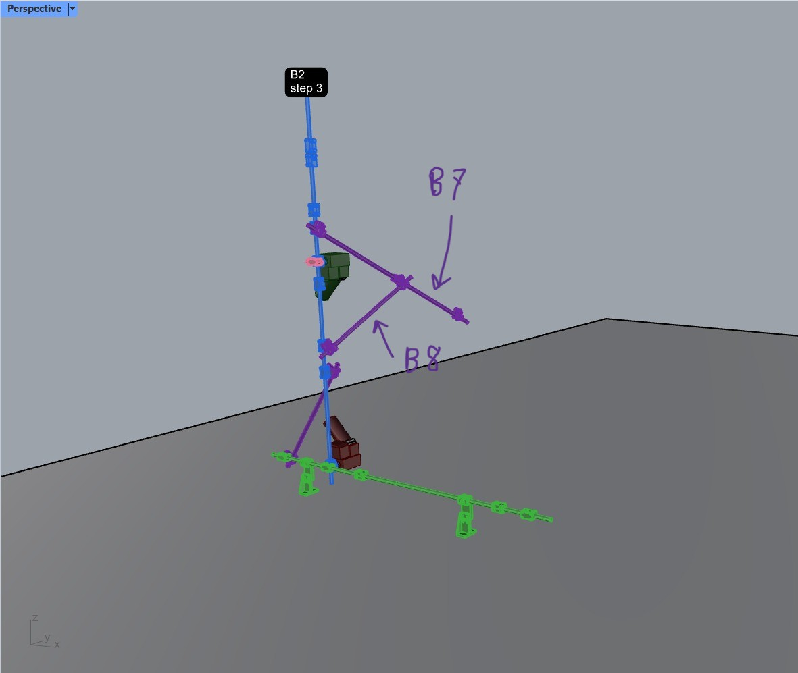
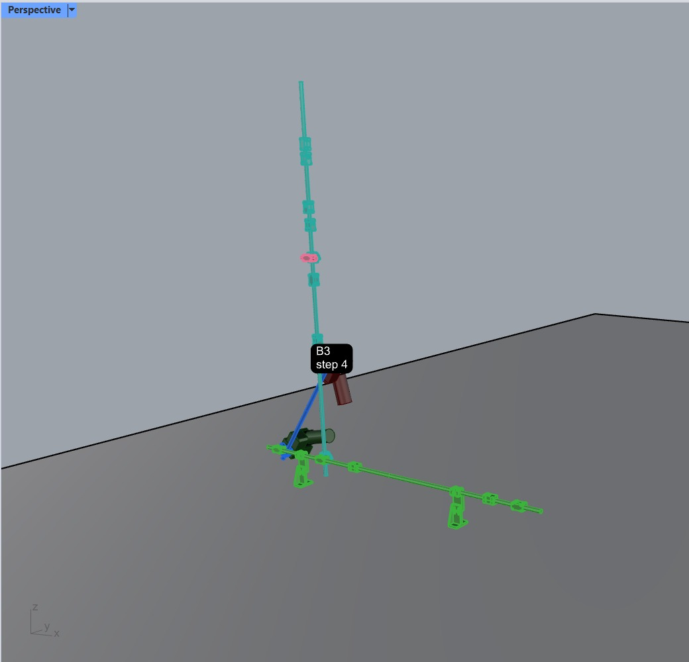
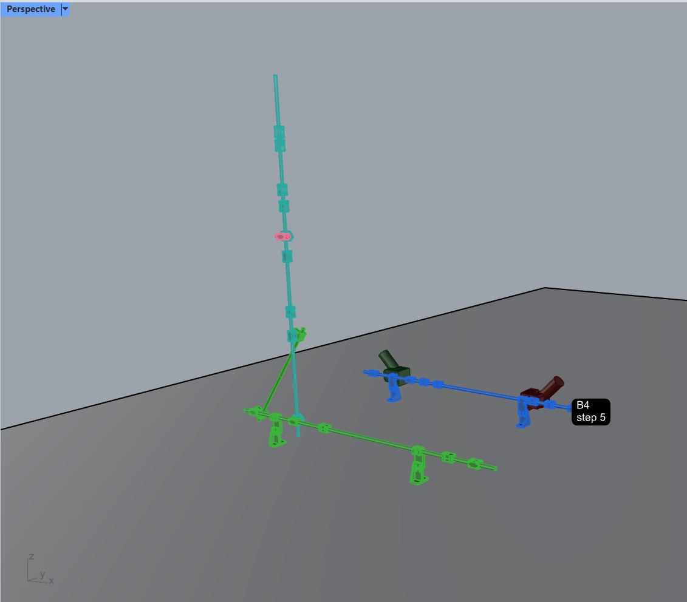
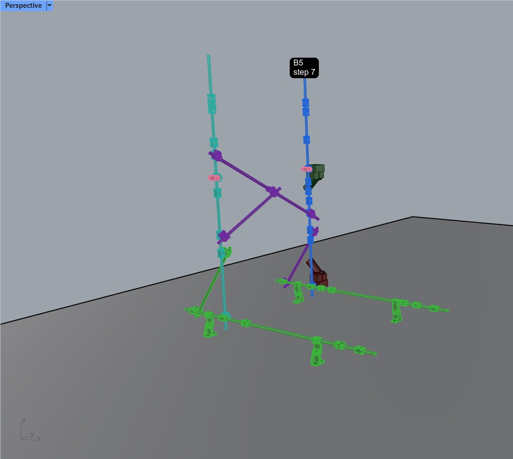
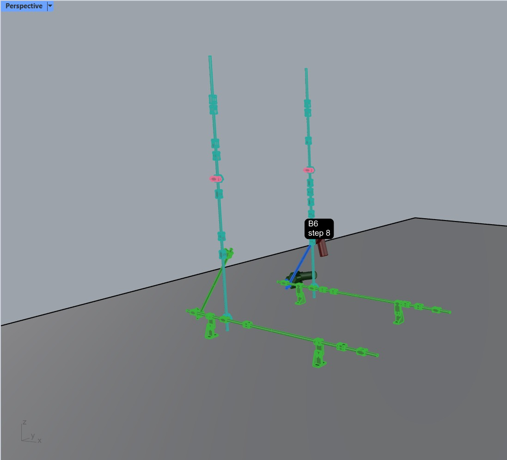
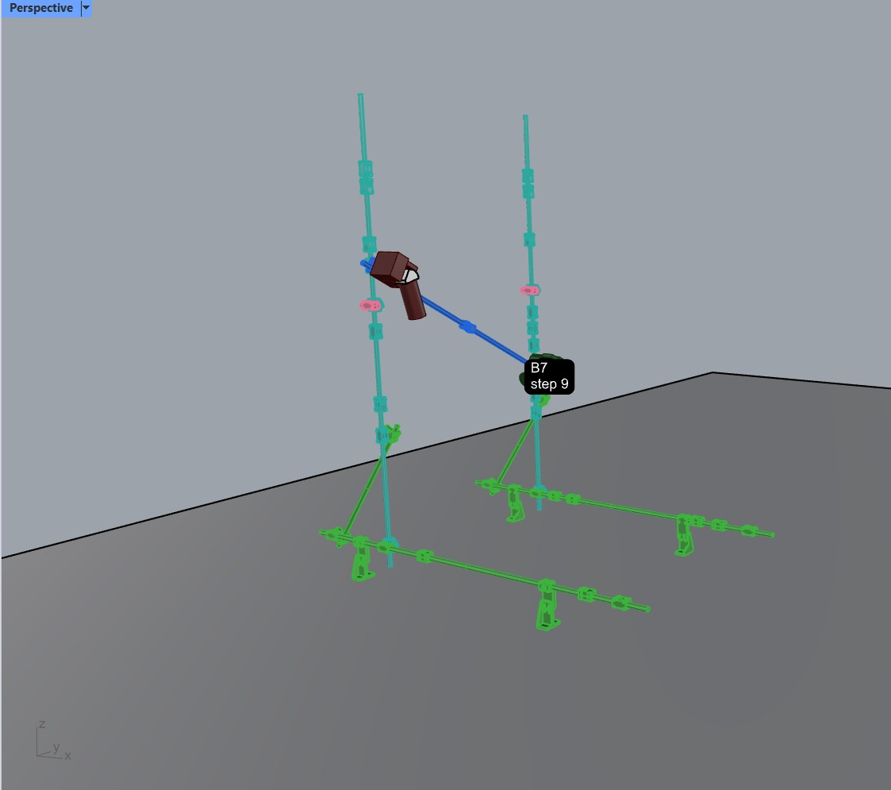
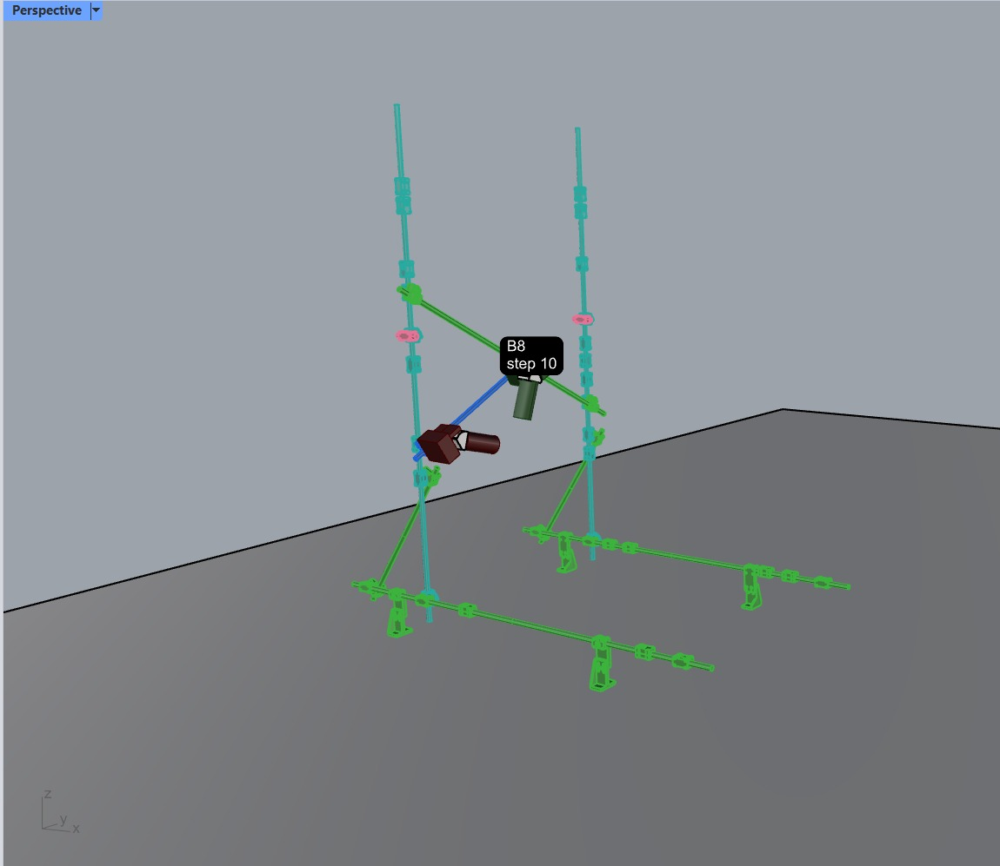
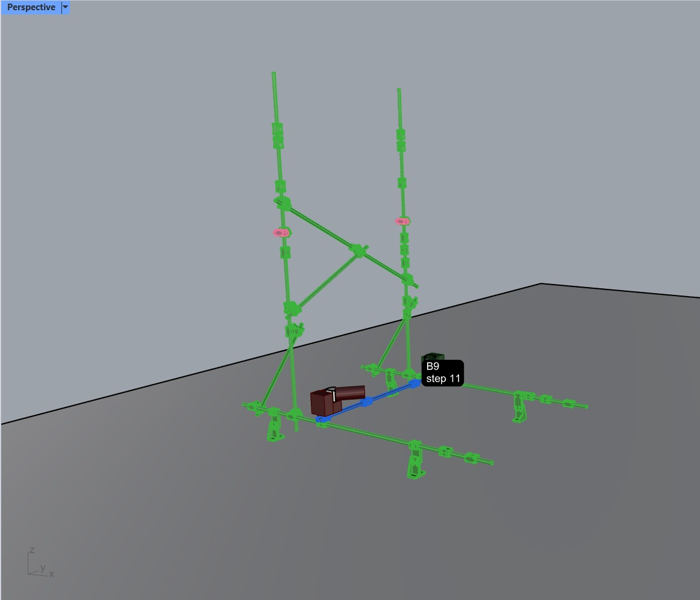

# Support Robot IK — Specification Report

**Goal.** Bring the support (holding) robots back into the IK keyframe workflow. Today only the dual-arm assembly robot has an action model (`BarAssemblyAction`); this work splits that model into a jointing half and a release half, adds two new holding actions for the single-arm support robots, and teaches the single `RSIKKeyframe` button to solve keyframes for both kinds of robot depending on the state of the bar you pick. A bar that is built but not yet stable (its `supported_until` list is not empty) must be held by a support robot until every bar in that list is built — only then may the assembly robot let go and, later, the support robot release. This pass changes only the Rhino side (`external\rs_data_structure` and `scripts\`); the headless planner in `husky_assembly_tamp` is a follow-up.

---

## 1. Robots

| Name | Short name | Type | Actions it can run |
| --- | --- | --- | --- |
| **Cindy** | AR | Dual-arm assembly robot | `BarAssemblyJointingAction`, `BarAssemblyReleaseAction` |
| **Alice** | SR1 | Single-arm support robot | `BarHoldingAction`, `BarHoldingReleaseAction` |
| **Belle** | SR2 | Single-arm support robot | `BarHoldingAction`, `BarHoldingReleaseAction` |

Alice and Belle are both single-arm Husky robots and are functionally equivalent, but each has its own calibrated URDF with different kinematic numbers, so their solved keyframes cannot be swapped between them. When a support robot is needed and more than one is free, pick the alphabetically first available one (Alice before Belle).

---

## 2. Action taxonomy

All four actions share the same base `Movement` and `Action` classes. The existing `bar_action.py` and a new `hold_action.py` (both in `external\rs_data_structure\rs_data_structure\`) build on that shared base. The holding actions also need the same scene-setup inputs the assembly action already carries — `active_bar_id`, `assembly_seq`, `walkable_ground_ids` — so those move into the shared base class.

**Clean break:** the old `BarAssemblyAction` class is removed outright, and previously exported action JSONs are discarded. No backwards compatibility layer.

**Controller note:** every robot movement uses the standard joint tracking controller, with one exception — the final linear insertion (movement 5 of the jointing action) uses the Cartesian compliant arm controller, and switches back to joint tracking once the robot reads a stall signal from the tool's tightening screws.

### 2.1 `BarAssemblyJointingAction` (assembly robot, 6 movements)

0. `IndependentDualArmFreeMovement` — both arms travel freely from wherever the robot currently is to the pose where the bar will be loaded (same as the old M0).
1. `ManualMovement` — a human operator mounts the bar into the robot's two end effectors.
2. `ScaffoldingToolMovement` — both tools drive their grasping screws to clamp the bar; the screws keep turning until they stall, meaning the bar is tightly held.
3. `EndEffectorConstrainedDualArmFreeMovement` — free transfer motion with the bar in hand, ending at the start of the insertion approach (same as the old M1).
4. `ScaffoldingToolMovement` — both tools start driving the jointing screws; **this movement deliberately overlaps the next one** — the screws keep turning through the whole insertion until they stall.
5. `EndEffectorConstrainedDualArmLinearMovement` — straight-line, bar-held insertion (same as the old M2). This is the one movement on the Cartesian compliant controller; the stall signal from movement 4's screws is what ends it and switches the controller back.

### 2.2 `BarAssemblyReleaseAction` (assembly robot, 3 movements)

1. `ScaffoldingToolMovement` — both tools run the screws backwards to let go of the joint and the bar.
2. `IndependentDualArmLinearMovement` — both arms retreat in a straight line, each on its own (same as the old M3).
3. `IndependentDualArmFreeMovement` — free travel to a given home pose (same as the old M4).

### 2.3 `BarHoldingAction` (support robot, 4 movements — corrected order)

0. `SingleArmFreeMovement` — the arm travels freely from the robot's current configuration to the start of the approach.
1. `GripperToolMovement` — gripper **opens** so it can receive the bar.
2. `SingleArmLinearMovement` — straight-line approach to the grasp location on the bar.
3. `GripperToolMovement` — gripper **closes**, now holding the bar.

Planning for this robot stops here: it stays frozen in this grasp until every bar in the held bar's `supported_until` list has been built.

### 2.4 `BarHoldingReleaseAction` (support robot, 2 movements)

1. `GripperToolMovement` — gripper **opens**, letting go of the bar.
2. `SingleArmLinearMovement` — straight-line retreat away from the grasp location.

---

## 3. Scheduling rules

- **Bar that needs no holding:** the assembly robot runs `BarAssemblyJointingAction` and `BarAssemblyReleaseAction` back to back.
- **Bar that needs holding:** the assembly robot runs `BarAssemblyJointingAction`, then must **wait** — it cannot let go until a support robot has finished its `BarHoldingAction` on that bar. Only then does the assembly robot run `BarAssemblyReleaseAction` and move on.
- **How long a hold lasts:** the support robot keeps its grip until every bar listed in the held bar's `supported_until` list is built. Only then may it run `BarHoldingReleaseAction`.
- **Holds can nest:** one of the bars needed to stabilize the held bar may itself need holding, which pulls in a second support robot. (In the demo below, SR1 holds B2 while B5 — one of B2's stabilizers — is built and then itself needs SR2 to hold it.)
- **After release:** a released support robot leaves the scene entirely — it is assumed to have driven far away and is not modeled as an obstacle for later steps.

---

## 4. Worked example — `docs\support_demo\1.jpeg` … `8.jpeg`

Color legend used below (from `docs\color_preview_reference.md`): **green** = built, **teal** = built but still unstable (its supports are not up yet), **blue** = the active step, **grey** = unbuilt, **purple** = support bar of the active step, **pink** = fake bar (staging that will not be fabricated; same pink as IK-failed).

Each screenshot carries a black label like "B2 step 3" — the bar id plus its index in the full assembly sequence. The green ground bars occupy the earlier steps not shown here. The dark red and dark green blocks that appear clamped on the active blue bar in every frame read as the assembly robot's two end-effector tools shown at their grasp poses (the tool inspector paints the LEFT tool red and the RIGHT tool green, so I assume the same mapping here — flagged as an assumption, not something the screenshots state).

> **Unsure (applies to all frames):** the small **pink** ring-shaped pieces sitting on the tall vertical bars match the fake-bar pink from the palette, so I read them as fake staging pieces, but I cannot confirm from the images alone. Also, unbuilt bars appear to be hidden entirely in these captures rather than painted grey — I assume that is a display choice for the demo.

### Step 1 — `1.jpeg`

Label: **"B2 step 3"**. The tall vertical bar is **blue** — B2, the active bar being placed. Hand-drawn arrows label two **purple** diagonals branching off to the right as **B7** and **B8**: support bars of B2 that are not built yet. Purple joint fittings also sit on B2, and one more purple diagonal runs down toward the ground row. The two long **green** rows on the ground with their little stands are the already-built earlier steps. The dark green tool block is clamped at mid-height on B2 (next to a pink ring) and the dark red tool block near its base — the assembly robot holding the bar at two points. B2 cannot be let go after placement: its hold must last until B5, B7, and B8 are all built (B7 can only come after the second vertical B5 exists).

> **Unsure:** the text says B2's hold waits on **B5, B7, B8**, but I do not see a purple vertical where B5 will stand — only the diagonals read clearly as purple. Either the purple preview shows only part of the wait set here, or B5's preview is hidden; worth confirming.

Actions fired at this step:

1. `BarAssemblyJointingAction(AR, B2)`

### Step 2 — `2.jpeg`

Label: **"B3 step 4"**. The vertical B2 is now **teal** — built but still unstable, which is exactly why a support robot must hold it before the assembly robot may let go. The pink ring remains at its mid-height. The short **blue** diagonal at the base is B3, the new active bar, with the dark red tool block at its top end and the dark green tool block at its bottom end near the **green** ground rows. B3 needs no holding of its own.

> **Unsure:** SR1 (Alice) fires its holding action at this step, but no support-robot gripper or arm is drawn in the capture — only the assembly robot's two tool blocks on B3 are visible.

Actions fired at this step:

1. `BarHoldingAction(SR1, B2)` — Alice grabs B2 so the assembly robot may release it
2. `BarAssemblyReleaseAction(AR, B2)`
3. `BarAssemblyJointingAction(AR, B3)`
4. `BarAssemblyReleaseAction(AR, B3)` — no holding needed, so release follows immediately

### Step 3 — `3.jpeg`

Label: **"B4 step 5"**. B2 stays **teal** (still held by SR1, pink ring visible). The diagonal B3 from the previous step now shows **green** at the base of the vertical — built and stable. The new active bar is the **blue** horizontal row floating at the right — B4, with its own blue stands, the dark green tool block toward its left portion and the dark red tool block at its right end, next to the step label. No holding required for B4.

Actions fired at this step:

1. `BarAssemblyJointingAction(AR, B4)`
2. `BarAssemblyReleaseAction(AR, B4)`

### Step 4 — `4.jpeg`

Label: **"B5 step 7"**. A second vertical now stands to the right in **blue** — B5, the active bar — with the dark green tool block on its upper half and the dark red block near its base. The left vertical B2 is still **teal** with its pink ring. Three **purple** bars show everything that must be built before B5's future holder may release: the upper diagonal spanning between the two verticals (B7), the middle diagonal (B8), and a short diagonal at B5's base (B6, the next active bar). The ground level is all **green**, now including B4's row at the rear right. Like B2, the assembly robot cannot let go of B5 right away.

> **Note:** the step labels jump from "step 5" (B4) to "step 7" (B5) — whatever bar is step 6 never appears in the captures. See Open points.

Actions fired at this step:

1. `BarAssemblyJointingAction(AR, B5)`

### Step 5 — `5.jpeg`

Label: **"B6 step 8"**. Both verticals are now **teal** — B2 held by SR1, B5 freshly held by SR2 — each with its pink ring. Because Alice (SR1) is still busy holding B2, a second support robot, Belle (SR2), had to be brought in for B5: this is the nesting case from the scheduling rules. The active **blue** bar is the short diagonal B6 at B5's base, dark red tool block at its top and dark green block at its bottom near the ground. Everything at ground level plus B3 is **green**. (The original walkthrough had a typo here — the holding action targets **B5**, not B2; B2 is already in SR1's grip.)

Actions fired at this step:

1. `BarHoldingAction(SR2, B5)` — Belle takes B5 (corrected from the original text's "B2")
2. `BarAssemblyReleaseAction(AR, B5)`
3. `BarAssemblyJointingAction(AR, B6)`
4. `BarAssemblyReleaseAction(AR, B6)`

### Step 6 — `6.jpeg`

Label: **"B7 step 9"**. Both verticals remain **teal**. The active **blue** bar is B7, the upper diagonal spanning from high on the left vertical down to the middle of the right vertical — the bar that could only be built once B5 existed. The large dark red tool block is clamped at its upper-left end (a small white patch shows inside it — I take that to be a highlighted sub-part, but I am not certain), and a dark green mass sits at the lower-right end, partly behind the step label — I read that as the second tool block but it is hard to make out. The diagonals B3 and B6 and all ground rows are **green**.

Actions fired at this step:

1. `BarAssemblyJointingAction(AR, B7)`
2. `BarAssemblyReleaseAction(AR, B7)`

### Step 7 — `7.jpeg`

Label: **"B8 step 10"**. The verticals are still **teal** while this step runs, and B7 now shows **green** at the top. The active **blue** bar is B8, the middle diagonal running from low on the left vertical up to the right; the dark red tool block clamps its lower-left end and the dark green tool block its upper-right end, next to the label. Once B8 is in, the last stabilizer for both B2 and B5 exists — so both support robots may finally release, and both verticals will turn green.

Actions fired at this step:

1. `BarAssemblyJointingAction(AR, B8)`
2. `BarAssemblyReleaseAction(AR, B8)`
3. `BarHoldingReleaseAction(SR1, B2)` — Alice lets go and leaves the scene
4. `BarHoldingReleaseAction(SR2, B5)` — Belle lets go and leaves the scene

### Step 8 — `8.jpeg`

Label: **"B9 step 11"**. The whole structure is now **green** — both verticals included, since their holds were released last step (the pink rings remain on them). The active **blue** bar is B9, a short horizontal at ground level bridging the two halves, with the dark red tool block at its left end and the dark green block at its right end mostly hidden behind the label. Both support robots are gone from the scene for this step — assumed driven far away, so they impose no collision constraints on B9's planning.

Actions fired at this step:

1. `BarAssemblyJointingAction(AR, B9)`
2. `BarAssemblyReleaseAction(AR, B9)`

---

## 5. Modeling multiple robots in one planning world

The compas_fab pybullet backend only supports one active robot per client, so:

- **Three parallel pybullet sessions**, one per robot (Cindy, Alice, Belle). Each session's active robot is its own; the **other two robots are frozen in place as articulated `Tool` obstacles**, with their arm configurations inherited from the previous state of the schedule. Their collision geometry is **always on** in every plan.
- By default all three sessions run **headless** (no window). If GUI mode is turned on in `rs_start_pb`, only the **assembly robot's** session opens a window; the two support-robot sessions stay headless.

---

## 6. UI and data notes

- **One button, state-driven, re-clickable in stages.** `RSIKKeyframe` stays a single button. When you pick a bar, the button decides which flow to run from the bar's state: if the bar **needs holding** (its `supported_until` list is not empty) **and** its assembly-robot keyframe is **already solved**, the click runs the **support-robot** flow; in every other case it runs the **assembly-robot** flow. Either part can be redone independently by clicking again on the same bar.
- **The needs-holding flag already exists.** It is the `supported_until` list, edited through `RSSequenceEdit > EditSupports`. No new data entry is needed to mark a bar as needing a hold.
- **Reuse from the old script.** `scripts\rs_ik_support_keyframe.py` is outdated (no action/movement/state management), but two of its pieces carry over: the **manual gripper-pose picking** on the bar, and the **ghost end-effector preview** shown while picking.
- **Storage.** Holding keyframes are written to the split **per-bar user-text keys**, not the legacy `ik_support` blob.
- **Export layout.** One action file **per bar**, plus a top-level **`ActionSchedule.json`** that lists the global interleaved order of all actions across all robots, each entry with an explicit robot assignment (this is exactly the ordered action lists in the walkthrough above, flattened into one file).
- **Scope.** Rhino side only: `external\rs_data_structure` and `scripts\`. The headless planner in `husky_assembly_tamp` is adapted in a follow-up pass.

---

## 7. Open points

Things I found underspecified or inconsistent while writing this — worth deciding before implementation:

1. **When is the holding-release retreat keyframe solved?** The holding flow deliberately stops planning after the gripper closes. The `BarHoldingReleaseAction` retreat still needs its own keyframe against a *later* scene (all stabilizers built). Is it solved in the same button click as the hold (against a predicted future scene), or by a separate click once the last stabilizer's keyframe exists?
2. **`RSIKKeyframeAll` batch behavior.** How does the batch command interact with the staged two-flow button — one full assembly pass over all bars followed by a support pass, or fully staged per bar in sequence order? Undefined so far.
3. **What does "available" mean for support-robot choice?** "Pick the alphabetically first available" needs a bookkeeping rule on the Rhino side: presumably an SR is busy from its `BarHoldingAction` until its `BarHoldingReleaseAction` in the schedule. Should the user be able to override the automatic choice?
4. **The missing step 6.** The screenshots jump from "B4 step 5" to "B5 step 7"; whichever bar occupies step 6 never appears in any frame. Is it a fake bar, a hidden bar, or a gap in the demo?
5. **Purple preview vs the full wait set.** In `1.jpeg` the text says B2's hold waits on B5, B7 and B8, but no purple vertical for B5 is visible. Does the purple preview show only the direct support bars (with prerequisites like B5 implied), or should B5 have been purple too?
6. **Home pose for the assembly release.** Movement 3 of `BarAssemblyReleaseAction` goes "to a given home pose" — where is that pose defined and stored (per bar, per robot, global)?
7. **Encoding overlapping movements.** The tighten-screws tool movement (jointing movement 4) runs concurrently with the linear insertion (movement 5) until stall. The movement list is otherwise strictly sequential — the data model needs an explicit way to say "this tool movement overlaps the next arm movement".
8. **Where released support robots go.** "Moved far away" removes them from the scene; is there an actual parking configuration recorded anywhere, or are they simply dropped from all three collision worlds after their release action?
9. **Which holding movements get keyframes.** The button is a keyframe tool: presumably the grasp pose (movement 3's pose) is picked manually and the approach start (end of movement 0) is derived from it by the linear-approach offset, with the free motions left to the headless planner — this reading should be confirmed.
10. **The pink ring pieces.** The small pink rings on the two verticals in the screenshots match the fake-bar pink; confirming they are fake staging pieces (and not IK-failed marks) would remove the one color ambiguity in the demo.
